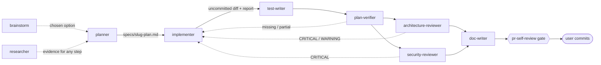

# Agents

Project subagents for Claude Code. This file is the map of the set; the rules live in each
agent's own file. It has no frontmatter, so Claude Code treats it as documentation, not as an
agent.

## Pipeline



Subagents cannot ask the user questions (`AskUserQuestion` is stripped from every subagent).
Each agent returns a `Clarification needed` / `Blocked` block instead, and the calling session
asks. A new `.claude/agents/<name>.md` is picked up by a running session (Claude Code 2.1.280).

## Catalog

| Agent | Responsibility | Model | Tools | Denied / enforced | Input | Output |
|---|---|---|---|---|---|---|
| [brainstorm](brainstorm.md) | Compares 2–4 options for one decision before a plan exists, against weighted drivers taken from the project rules | opus | Read, Grep, Glob, Bash | Write, Edit, MultiEdit, NotebookEdit, Skill, Agent, Web*; `readonly-guard` | A decision or goal + a boundary | MADR-style options report + a ready task for the planner |
| [researcher](researcher.md) | Answers one concrete question with evidence — REPO (code, docs, specs, INSIGHTS, git history) or EXTERNAL (official docs, changelogs, issues, standards) | sonnet | Read, Grep, Glob, Bash (read-only by instruction), WebSearch, WebFetch | Write, Edit, NotebookEdit, Skill, Agent — so no `/deep-research`, no subagents | A concrete question with a purpose or scope | Research report: answer + confidence, findings with `file:line` / commit / URL, references, **Not found / unverified** |
| [planner](planner.md) | Turns a spec or task into a staged Development Plan that fits the modules, INSIGHTS, architecture rules and the skills the implementer will load | opus | Read, Grep, Glob, Bash (read-only by instruction); `permissionMode: plan` | Write, Edit, NotebookEdit, Skill, Agent, WebSearch, WebFetch | `specs/<slug>.md` or a task with a goal and a boundary | Development Plan (text) — the calling session saves it to `specs/<slug>-plan.md` once approved |
| [implementer](implementer.md) | Executes an approved plan in `server/`, `client/`, `reviewer-core/`: loads skills per stage, edits, adds tests, runs the verification commands | sonnet | Read, Grep, Glob, Edit, Write, Bash, Skill; preloads `onion-architecture`, `frontend-ui-architecture` | Agent, WebSearch, WebFetch, NotebookEdit; `implementer-guard` | `specs/<slug>-plan.md` with no `[blocking]` question open | Implementation report: stages, deviations, skills applied, verification table, AC evidence, handoff to reviewers, blockers; plus the uncommitted diff |
| [test-writer](test-writer.md) | Writes client / server / reviewer-core tests from the plan's ACs and the spec (not from the current code), with the skills `routing.md` names, and runs them | sonnet | Read, Grep, Glob, Edit, Write, Bash, Skill | Agent, WebSearch, WebFetch, NotebookEdit; `write-scope-guard --profile tests` | A plan + stages, ACs without test evidence, or files + behaviours | Test report: tests written, static checks, test runs (passed/failed/skipped), gaps for the implementer |
| [plan-verifier](plan-verifier.md) | Traceability check: every plan item (§0–8) and every spec requirement / AC / non-goal → done, partial, missing or deviated, with `file:line`; plus changes no plan item covers | sonnet | Read, Grep, Glob, Bash | Write, Edit, MultiEdit, NotebookEdit, Skill, Agent, Web*; `readonly-guard --allow-tests` | `specs/<slug>-plan.md` (+ spec, + implementation report) | Verification report: spec → plan → code, plan items, ACs, unplanned changes, needs a test run, not verifiable |
| [architecture-reviewer](architecture-reviewer.md) | Architecture-boundary review of the diff: onion layering (depcruise and beyond), client placement and imports, path aliases, the two `@devdigest/shared` copies | opus | Read, Grep, Glob, Bash, Skill; preloads `onion-architecture`, `frontend-ui-architecture` | Write, Edit, MultiEdit, NotebookEdit, Agent, Web*; `readonly-guard` | The open diff (optional base, plan, report) | Findings in the shared contract + checks run + JSON |
| [security-reviewer](security-reviewer.md) | Exploitable vulnerabilities only: attacker-controlled source → sink, with band, confidence, CWE/OWASP and an exploit path. Not the product's Security Reviewer (`docs/agent-prompts/`) | opus | Read, Grep, Glob, Bash, Skill; preloads `security` | Write, Edit, MultiEdit, NotebookEdit, Agent, Web*; `readonly-guard` | The open diff (optional base, plan, report) | Findings in the shared contract + threat model + surfaces examined + JSON |
| [doc-writer](doc-writer.md) | Documents implemented features in the right place (`docs/`, package `docs/`, READMEs, `TESTING.md`) with Mermaid diagrams, and links them from `AGENTS.md` Read when | sonnet | Read, Grep, Glob, Edit, Write, Bash, Skill; preloads `mermaid-diagram` | Agent, WebSearch, WebFetch, NotebookEdit; `write-scope-guard --profile docs` | Subject + plan / spec / report / files | Documentation report: placement, files, links, checks, code-vs-plan discrepancies |

`pr-self-review` (a skill, not an agent) stays the only merge gate; the reviewer agents run
before it with the same scope scripts, routing and severity rubric, so a CRITICAL here is a
CRITICAL there.

## Shared contracts between agents

- **Self-containment** — every agent must behave as written for any developer, whatever their
  personal `~/.claude` settings, plugins or permission mode. Each agent states the rules it
  needs in its own file or names the project file that holds them; hard limits are enforced by
  the guards below, not by `permissionMode` (a session running in `bypassPermissions` forces
  its subagents into it).
- **Tests** — project policy (`../../AGENTS.md` § Conventions): tests may be run without
  asking. test-writer runs what it writes, plan-verifier may run the plan's §6 commands; the
  other read-only agents do not run tests. No agent runs browser e2e or starts the dev stack.
- **File → skill routing** — `planner` picks skills and `implementer` / `test-writer` load them
  from the same table, [`../skills/pr-self-review/rules/routing.md`](../skills/pr-self-review/rules/routing.md),
  which `pr-self-review` also uses. Change routing there (and in `route-skills.sh`, its
  executable twin), not in an agent.
- **Plan format** — sections 0–8 defined in `planner.md` (Step 4). `implementer` reads §4–8,
  `plan-verifier` reads §0–8 plus the spec. A change to Step 4 updates both agents.
- **Review finding** — `architecture-reviewer` and `security-reviewer` share one line,
  `Finding fields: severity · band · file · line · in_diff · skill · rule_source · title · evidence · failure · fix · verified`
  (`check-agents.sh` fails if the two drift). Gate severity comes from
  [`../skills/pr-self-review/rules/severity.md`](../skills/pr-self-review/rules/severity.md).
  Security adds a band (Critical/High/Medium/Low from reachability × impact × preconditions)
  and a confidence: HIGH + Critical/High → CRITICAL (three-part test still applies);
  Medium band or MEDIUM confidence → WARNING; Low or LOW → not reported.
- **Write scopes** — test-writer: test files only; doc-writer: doc files only; the four
  reviewing agents: nothing. See Guards.
- **Session protocol** — agents read `INSIGHTS.md` in full before acting
  (`../../AGENTS.md` § Session protocol); the writing agents close with `engineering-insights`.

## Guards

`PreToolUse` hooks declared in each agent's frontmatter; active only while that agent runs, on
top of the project hook in `../settings.json` (`guard-pr.sh`). All three share
[`scripts/guard-lib.sh`](scripts/guard-lib.sh).

| Guard | Used by | Allows | Blocks |
|---|---|---|---|
| `implementer-guard.sh` | implementer | everything else | git history / working-tree commands, branch delete/move, `gh pr` writes; `db:migrate`, `db:seed`, `drizzle-kit migrate/push/drop`, `dropdb`, `pg_restore`, `psql` writes; `docker compose down -v`, volume rm/prune; lockfiles, `server/package.json`, migrations, `server/clones/**`, `.env*` (not `.env.example`); the guards, `implementer.md`, this README, `.claude/settings*.json`; paths outside the repo |
| `readonly-guard.sh [--allow-tests]` | brainstorm, plan-verifier (`--allow-tests`), architecture-reviewer, security-reviewer | Bash allowlist: read-only git, text tools (`grep`, `sed -n`, `find` without actions, `jq`, …), `typecheck`, `depcruise`, `tsc --noEmit`, `collect-diff.sh`, `route-skills.sh`, `check-agents.sh`, `check-guards.sh`, `bash -n`; `vitest run` with `--allow-tests` | every file-writing tool; any other command; redirects into files, `--output`, `sed -i`, `find -delete/-exec`, `sort -o`; snapshot updates and watch mode |
| `write-scope-guard.sh --profile tests` | test-writer | Edit/Write on `*.test.ts(x)`, `server/test/**`, `reviewer-core/test/**`, `client/src/test/**` (not `setup.ts`), `tsconfig.test-check.json`; `vitest run`; `append-insight.sh` | production code, vendor contracts, specs, `.claude/**`, `INSIGHTS.md`, `CLAUDE.md`; the implementer-guard Bash denylist; installs, `dev.sh`, `e2e.sh`, `agent-browser`, `prettier --write`, `*:fix`; `rm/mv/cp/tee/sed -i/node -e`, file redirects |
| `write-scope-guard.sh --profile docs` | doc-writer | Edit/Write on `docs/*.md`, `<pkg>/docs/*.md`, README files, `TESTING.md`, `AGENTS.md` files; `append-insight.sh` | the same as tests, plus every test runner; `docs/agent-prompts/**`, `docs/design/**` |

Every guard fails closed: no `jq` → the payload is read with `node` (a project requirement);
neither → every tool call is blocked; any unexpected error exits 2, never 1 (Claude Code
treats exit 1 as "allow"). Bash parsing is deliberately naive and errs towards blocking; the
rules are also written in each agent's text because frontmatter hooks run only after the
workspace-trust dialog is accepted.

Check a change to the guards or agents without running them as hooks:

```bash
.claude/agents/scripts/check-guards.sh          # every row of scripts/guard-cases.tsv
.claude/agents/scripts/check-agents.sh          # frontmatter, skills, hooks, this catalog
.claude/agents/scripts/readonly-guard.sh --check "git stash"   # exit 2
```

A new guard rule gets a row in `scripts/guard-cases.tsv` — both an allow and a deny case.

## Sources behind the agents

**Claude Code documentation** (read 2026-09-27):

| Rule | Source |
|---|---|
| Explore → plan → implement as separate phases; a self-contained plan executed in a fresh context | [Best practices](https://code.claude.com/docs/en/best-practices) |
| A fresh-context reviewer checks the diff against the plan and reports gaps, not style; evidence, not claims | [Best practices](https://code.claude.com/docs/en/best-practices) — adversarial review, "Give Claude a way to verify its work" |
| Frontmatter fields, `tools` / `disallowedTools`, `skills:` preload, hooks scoped to one agent, no `AskUserQuestion`, a `bypassPermissions` session overrides the agent's mode | [Subagents](https://code.claude.com/docs/en/sub-agents), [Permission modes](https://code.claude.com/docs/en/permission-modes) |
| Path-scoped writes are not a frontmatter field → hooks | [Permissions](https://code.claude.com/docs/en/permissions), [anthropics/claude-code#31940](https://github.com/anthropics/claude-code/issues/31940) (closed, not planned) |
| Hook exit codes (2 blocks, 1 does not) | [Hooks](https://code.claude.com/docs/en/hooks) |
| Find → verify → filter, a separate verification step against false positives | [Code Review](https://code.claude.com/docs/en/code-review), [Building effective agents](https://www.anthropic.com/research/building-effective-agents) |

**Reviewers:**

| Rule | Source |
|---|---|
| Report only exploitable issues; exclusion list; confidence ≥ 0.8; exploit scenario per finding | [claude-code-security-review — `security-review.md`](https://github.com/anthropics/claude-code-security-review/blob/main/.claude/commands/security-review.md), [`findings_filter.py`](https://github.com/anthropics/claude-code-security-review/blob/main/claudecode/findings_filter.py) |
| Band from reachability × impact × preconditions; four bands | [CVSS v4.0](https://www.first.org/cvss/v4.0/specification-document), [GitHub code scanning severity](https://docs.github.com/en/code-security/concepts/code-scanning/code-scanning-alerts), [OWASP Risk Rating](https://owasp.org/www-community/OWASP_Risk_Rating_Methodology) |
| Prompt injection from PR content | [OWASP LLM Top 10 (2025)](https://genai.owasp.org/llm-top-10/), [CWE-1427](https://cwe.mitre.org/data/definitions/1427.html) |
| A finding = a named rule + the violating edge + `file:line` | [Building Evolutionary Architectures](https://nealford.com/books/buildingevolutionaryarchitectures.html) (fitness functions), [dependency-cruiser](https://github.com/sverweij/dependency-cruiser), [Onion](https://jeffreypalermo.com/2008/07/the-onion-architecture-part-1/), [Hexagonal](https://alistair.cockburn.us/hexagonal-architecture) |
| Bidirectional traceability (spec → plan → code, code → plan) | [ISO/IEC/IEEE 29148 via ReqView](https://www.reqview.com/blog/requirements-traceability-matrix/); the four statuses are this project's convention |

**Writers and brainstorm:**

| Rule | Source |
|---|---|
| Assertions from the spec, not from the current code; test as the user uses it | [LLM unit-test survey (arXiv 2511.21382)](https://arxiv.org/html/2511.21382), [Testing Library principles](https://testing-library.com/docs/guiding-principles/), [Write tests](https://kentcdodds.com/blog/write-tests) |
| Doc type by the reader's need; diagram type by C4 level | [Diátaxis](https://diataxis.fr/), [C4 model](https://c4model.com/), [Mermaid](https://mermaid.js.org/syntax/flowchart.html), [Docs as Code](https://www.writethedocs.org/guide/docs-as-code/) |
| Drivers before options, ≥ 2 options incl. a baseline, pros/cons, consequences | [MADR](https://adr.github.io/madr/), [Nygard ADR](https://cognitect.com/blog/2011/11/15/documenting-architecture-decisions), [ADR mistakes](https://ozimmer.ch/practices/2026/09/12/ADRMistakes.html), [decision matrix](https://en.wikipedia.org/wiki/Decision-matrix_method); the stop rule is this project's convention |

Model split (opus for judgement across files, sonnet for rule-following execution) is a
project decision, not a documented rule.

**Repository:**

| Rule | Source |
|---|---|
| Packages, commands, naming, do-not-touch, dual contract copies, test policy | `../../AGENTS.md` and the package `AGENTS.md` files |
| Test lanes, `*.it.test.ts`, direct vitest calls, self-skipping integration tests | `../../TESTING.md` |
| Layering rules | `../../server/.dependency-cruiser.cjs`, `../skills/onion-architecture/` |
| Frontend placement | `../skills/frontend-ui-architecture/` |
| Severity and the gate | `../skills/pr-self-review/rules/severity.md` |
| Doc placement | `../../docs/README.md` § Rules |
| Spec vs plan | `../../specs/README.md`; plan layout in `planner.md` Step 4 |
| INSIGHTS before the first edit, capture at the end | `../../AGENTS.md` § Session protocol, `../skills/engineering-insights/` |
