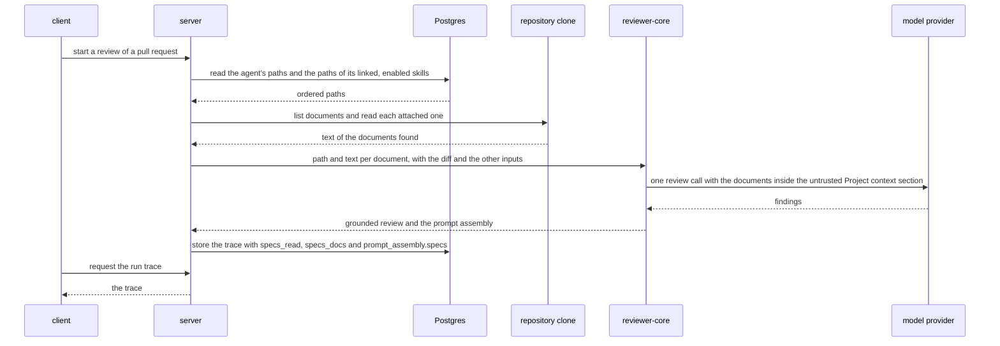

# Spec: Project Context
Spec ID: SPEC-01
Status: approved
Supersedes: none

## Problem and user

Two roles have the problem. An **agent author** configures reviewer agents and the skills
they load. A **reviewer** runs those agents on a pull request and reads what they found.

A repository's own rules — product requirements, architecture invariants, incident
lessons — live in Markdown documents under its `specs`, `docs` and `insights` folders.
Today a reviewer agent never sees them:

- The prompt has a `## Project context` slot (`reviewer-core/src/prompt.ts:223`), but no
  caller fills it: the run passes no documents (`server/src/modules/reviews/run-executor.ts:314`)
  and every trace is stored with `specs_read: []` (`server/src/modules/reviews/run-executor.ts:431`).
- No screen lists the documents. The client hooks for `GET /repos/:id/context` exist
  (`client/src/lib/hooks/core.ts:123`), the route they call does not, and the sidebar has no
  Project Context item (`client/src/vendor/ui/nav.ts`).
- The agent author has no way to say which documents an agent or a skill relies on, and
  no way to see what they would add to each prompt in tokens.
- A reviewer reading a run's trace cannot tell which project knowledge the agent had,
  because it had none.

The consequence, in the user's own example (IN-2): a pull request that makes a file under
`api/` import from `db/` directly is reviewed by an agent that was never shown the document
stating that this is forbidden. The problem is known from the user's description (IN-1,
IN-2) and from the code read at 905cd86 (IN-7, IN-8, IN-9).

## Goals / Non-goals

- **G-1** A reviewer finds, on one Project Context page, every Markdown document under the active repository's `specs`, `docs` and `insights` folders and reads it rendered.
- **G-2** An agent author attaches documents to an agent by hand, in a chosen order, and sees the token estimate they add to each prompt.
- **G-3** An agent author attaches documents to a skill, and every agent that uses the skill receives them.
- **G-4** A review run reads the attached documents from the repository when it starts and sends them to the model as untrusted data in one `## Project context` section, without an extra model call.
- **G-5** A run's trace shows which documents were read, the token estimate of each, and the full text that was sent.
- **NG-1** Automatic selection of documents from a pull request's content — the user moved it to a separate feature; documents are chosen by hand.
- **NG-2** Creating, editing, uploading or deleting documents or folders from the product (the page frame's Edit toggle and its plus, folder and upload icons) — the user chose a read-only page; the clone is a mirror that a resync resets (`server/src/adapters/git/simple-git.ts:102-111`). The page's refresh resyncs that mirror from GitHub and writes no document content into it.
- **NG-3** `.devdigest/specs/` or any other dot-directory as a place where documents are found — the user chose the written roots only.
- **NG-4** A chunk or embedding index of documents (the page frame's "Indexed … chunks" footer, the pre-wired `IndexStatus` contract and the hook for `POST /repos/:id/context/reindex`) — an index serves only automatic selection, which is NG-1; the refresh of AC-17 goes through the existing repo-intel resync, which indexes code and not these documents.
- **NG-5** The COVERAGE ring of the page frame — no source says what it measures.
- **NG-6** Storing document text with an agent or a skill — the user asked for paths in the metadata, not text; the text is read when a run starts.
- **NG-7** Writing the path list or document text into the trusted `## Skills / rules` section or into a skill's body, or changing a skill's version on attach — the user chose one untrusted block for all documents.
- **NG-8** Changes to the MCP tools — a run started through `run_agent_on_pr` goes through the same run path, and no tool reads the trace or the new routes.
- **NG-9** The other differences between the trace frame and today's drawer (a "Skills loaded" row, no Provider row, the order and wording of the other prompt rows) — they belong to other features.
- **NG-10** Attaching a document to agents or skills from the Project Context page itself — attaching happens in the two Context tabs; the page only shows how many agents use a document.

## User stories

- **US-1** As a reviewer, I want one page that lists every Markdown document found under the repository's specs, docs and insights folders, so that I know which project knowledge exists.
- **US-2** As a reviewer, I want to open a listed document and read it rendered, so that I can judge whether it is worth attaching.
- **US-3** As an agent author, I want to tick documents in an editor's Context tab and put them in order, so that every run receives exactly those documents.
- **US-4** As an agent author, I want to see the token estimate of the attached documents next to the list, so that I know what they add to each prompt before any run is paid for.
- **US-5** As an agent author, I want to attach documents to a skill, so that every agent using the skill inherits them without my attaching them agent by agent.
- **US-6** As a reviewer, I want a run to read the attached documents from the repository and give them to the model as untrusted data, so that findings are checked against the project's own rules while a document stays unable to change the reviewer's instructions.
- **US-7** As a reviewer, I want a run's trace to show which documents were read, their size in tokens and the full text that was sent, so that I can tell what the agent knew when it wrote a finding.
- **US-8** As a repo owner, I want the folders that are searched to come from configuration, so that a repository with other folder names is covered without a code change.

## Acceptance criteria (EARS)

Terms used below. "The Context tab" is the tab in both editors — the agent editor at
`/agents/:id?tab=context` and the skill editor at `/skills/:id?tab=context`; a criterion
that holds for one of them names it. "The owner" is the agent or the skill whose tab is
open. "The document list" is the response of `GET /repos/:id/context`. "The attachment
list" is the ordered `paths` of one owner. "Inherited documents" are the ones an agent
gets from its linked, enabled skills. Contracts are under Module interactions.

- **AC-1** [event-driven] WHEN a client requests `GET /repos/:id/context`, the API shall return one entry for every `.md` file that lies under a folder named as a configured root, at any depth of that repository's clone. — covers: US-1 · verify: integration — a seeded repository whose clone holds `.md` files under specs, docs and insights folders at two depths, one `.md` outside them and one `.txt` inside them returns exactly the first group
- **AC-2** [ubiquitous] The API shall take its search roots from server configuration and search `**/{specs,docs,insights}/**/*.md` when none is configured. — covers: US-8 · verify: unit — with the setting absent the configuration loader yields the default and discovery over a temporary tree returns the files under folders named specs, docs and insights at any depth; with the setting present discovery follows it
- **AC-3** [ubiquitous] The API shall leave out of the document list every file that lies inside a directory whose name starts with a dot. — covers: US-1 · verify: unit — files under `.devdigest/specs/` and `.github/docs/` are not returned
- **AC-4** [ubiquitous] The API shall set each document's `type` to the name of the root folder that comes first in its path, read from the repository root. — covers: US-1 · verify: unit — a file under a specs folder gets `specs`; a file under a specs folder that sits inside a docs folder gets `docs`
- **AC-5** [ubiquitous] The API shall order the document list by `type` in the order the roots are configured and then by `path`. — covers: US-1 · verify: unit — specs documents come before docs documents and those before insights documents; within one type the paths ascend
- **AC-6** [event-driven] WHEN a client requests `GET /repos/:id/context/document` with the `path` of a listed document, the API shall return that document's `path`, `type`, `tokens` and full `content`. — covers: US-2 · verify: integration — the response holds the file's exact text
- **AC-7** [unwanted] IF the `path` of a document request is not in the repository's document list, THEN the API shall answer 404 and return no file content. — covers: US-2 · verify: integration — a path with a `..` segment, an absolute path, a source file and a `.md` file outside the roots each get 404
- **AC-8** [unwanted] IF the repository has no clone on disk, THEN the API shall answer the list request with 200 and an empty `documents` array. — covers: US-1 · verify: integration — a repository row whose clone directory does not exist returns 200 and no documents
- **AC-9** [unwanted] IF the repository, agent or skill named in a Project Context route does not belong to the caller's workspace, THEN the API shall answer 404. — covers: US-1 · verify: integration — an unknown uuid on each of the six routes returns 404
- **AC-10** [ubiquitous] The sidebar shall show a Project Context item in the WORKSPACE group that links to `/repos/:repoId/context` for the active repository. — covers: US-1 · verify: component — the navigation renders the item with that link and marks it active on the route
- **AC-11** [event-driven] WHEN the reviewer opens the Project Context page, the Project Context page shall list every document the API returned with its file name, its folder and its type badge. — covers: US-1 · verify: component — a mocked list with documents of three types renders one row per document showing name, folder and badge text
- **AC-12** [event-driven] WHEN the reviewer types in the page's search box, the Project Context page shall show only the documents whose path contains the typed text, ignoring letter case. — covers: US-1 · verify: component — typing part of a path in another letter case leaves the matching rows only
- **AC-13** [event-driven] WHEN the reviewer selects a document, the Project Context page shall show that document's content rendered as Markdown, with headings as heading elements and list items as list elements. — covers: US-2 · verify: component — a document with `#`, `##` and `-` lines produces `h1`, `h2` and `li` elements
- **AC-14** [ubiquitous] The Project Context page shall display a rendered document's headings in a larger font than its body text and its list items with bullet markers. — covers: US-2 · verify: manual — computed heading and list styles come from the global stylesheet and are not observable in jsdom; checked by eye on a document with headings and a list
- **AC-15** [state-driven] WHILE a document is selected, the Project Context page shall show the number of agents that use it, taken from the document's `agent_count`. — covers: US-2 · verify: component — `agent_count` 3 renders "Used by 3 agents"; 1 renders the singular form
- **AC-16** [ubiquitous] The API shall set a document's `agent_count` to the number of agents in the workspace that have its path attached directly or through a linked, enabled skill. — covers: US-2 · verify: integration — an agent attaching the path, an agent linked to an enabled skill that attaches it and an agent linked to a disabled skill that attaches it give 2
- **AC-17** [event-driven] WHEN the reviewer activates the refresh control, the Project Context page shall send `POST /repos/:id/resync` for the active repository. — covers: US-1 · verify: component — the mocked `fetch` receives that request, and no list request follows until the index state changes
- **AC-18** [ubiquitous] The Project Context page shall show the number of documents found. — covers: US-1 · verify: component — 12 mocked documents render "12 files"; 1 renders the singular form
- **AC-19** [ubiquitous] The Project Context page shall offer no control that creates, edits, uploads or deletes a document or a folder. — covers: US-1 · verify: component — the rendered page has no Edit toggle and no add, new-folder or upload button
- **AC-20** [state-driven] WHILE the document list is loading, the Project Context page shall show a loading placeholder in place of the list. — covers: US-1 · verify: component — a pending request renders the placeholder and no rows
- **AC-21** [unwanted] IF the document list is empty, THEN the Project Context page shall show an empty state that names the folders being searched. — covers: US-1 · verify: component — an empty `documents` with `roots` specs, docs and insights renders the three names
- **AC-22** [unwanted] IF the document list request fails, THEN the Project Context page shall show an error message with a control that repeats the request. — covers: US-1 · verify: component — a failed request renders the message; activating the control issues the request again
- **AC-23** [unwanted] IF the repository id in the URL matches no repository, THEN the Project Context page shall show the no-repository empty state that the other repository pages show. — covers: US-1 · verify: component — an unknown repository id renders that state and issues no list request
- **AC-24** [event-driven] WHEN the reviewer selects a document, the Project Context page shall write that document's path into the `doc` query parameter of the URL. — covers: US-2 · verify: component — selecting a row calls the router with the path in `doc`
- **AC-25** [event-driven] WHEN the page loads with a `doc` parameter that names a listed document, the Project Context page shall show that document selected. — covers: US-2 · verify: component — rendering with the second document's path in `doc` shows its content
- **AC-26** [unwanted] IF the `doc` parameter is absent or names no listed document, THEN the Project Context page shall show the first document of the list selected. — covers: US-2 · verify: component — no parameter, and a parameter naming a path that is not listed, both show the first row's content
- **AC-27** [unwanted] IF the request for a document's content fails, THEN the Project Context page shall show an error message in the document pane in place of the content. — covers: US-2 · verify: component — a 404 on the document request renders the message and leaves the list usable
- **AC-28** [unwanted] IF a document's `type` is none of `specs`, `docs` and `insights`, THEN the web app shall show the type's own text on a badge of the neutral colour. — covers: US-1 · verify: component — a document of type `adr` renders a badge reading "adr" that carries none of the three type colours
- **AC-29** [event-driven] WHEN the agent editor or the skill editor is opened with `tab=context` in its URL, the Context tab shall be the tab on screen. — covers: US-3 · verify: component — each editor rendered with that URL shows the Context tab's heading
- **AC-30** [event-driven] WHEN the agent author opens the Context tab, the Context tab shall list every document of the repository that is active in the sidebar, each row with a checkbox, the file name, the folder, the type badge and a Preview control. — covers: US-3 · verify: component — seven mocked documents render seven rows, each with those five parts
- **AC-31** [ubiquitous] The Context tab shall show attached documents first, in attachment order, followed by the other documents in the order the API returned them. — covers: US-3 · verify: component — with the fifth and the second listed documents attached in that order, the rows start with the fifth, then the second, then the rest
- **AC-32** [event-driven] WHEN the agent author types in the filter box, the Context tab shall show only the rows whose path contains the typed text, ignoring letter case. — covers: US-3 · verify: component — typing part of a path leaves the matching rows only, attached or not
- **AC-33** [event-driven] WHEN the agent author ticks the checkbox of an unattached document, the Context tab shall send a `PUT` to the owner's `/context` route with that path appended to the attachment list. — covers: US-3 · verify: component — the mocked `fetch` receives `PUT /agents/:id/context`, and `PUT /skills/:id/context` in the skill editor, with the path last in `paths`
- **AC-34** [event-driven] WHEN the agent author clears the checkbox of an attached document, the Context tab shall send the attachment list without that path. — covers: US-3 · verify: component — the `PUT` body holds the other paths in their earlier order
- **AC-35** [event-driven] WHEN the agent author drops an attached row onto another attached row, the Context tab shall send the attachment list with the dragged path moved to the target's position. — covers: US-3 · verify: component — drag-start and drop events on two attached rows produce a `PUT` with the new order
- **AC-36** [event-driven] WHEN the agent author activates the move-earlier or move-later button of an attached row, the Context tab shall send the attachment list with that path moved by one position. — covers: US-3 · verify: component — the button on the second attached row produces a `PUT` with it first; the first row's move-earlier button is disabled
- **AC-37** [state-driven] WHILE the document list or the attachment list is loading, the Context tab shall keep every checkbox and every move control disabled. — covers: US-3 · verify: component — with the attachment request pending no checkbox reacts and no `PUT` is sent
- **AC-38** [unwanted] IF saving the attachment list fails, THEN the Context tab shall show the last saved list again together with an error message. — covers: US-3 · verify: component — a rejected `PUT` returns the rows to their earlier state and renders the message
- **AC-39** [unwanted] IF an attached or inherited path is not in the active repository's document list, THEN the Context tab shall show its row marked as not found in this repository. — covers: US-3 · verify: component — an attachment list holding a path absent from the mocked document list renders that row with the label and an operable checkbox; clearing it sends the list without the path
- **AC-40** [ubiquitous] The agent editor's Context tab shall show the heading "Project context" and a badge with the number of attached documents out of the number listed. — covers: US-3 · verify: component — 2 attached of 7 listed renders "2 of 7 attached"
- **AC-41** [event-driven] WHEN the agent author activates a row's Preview control, the Context tab shall open a dialog that shows the document's rendered content and its token estimate. — covers: US-3 · verify: component — the dialog renders the mocked content; closing it leaves the rows and the filter as they were
- **AC-42** [unwanted] IF the active repository has no documents and nothing is attached, THEN the Context tab shall show an empty state that names the folders being searched. — covers: US-3 · verify: component — an empty document list and an empty attachment list render the folder names
- **AC-43** [unwanted] IF no repository is active, THEN the Context tab shall show a notice that a repository is needed to list documents. — covers: US-3 · verify: component — with no repository in the workspace the notice renders and no list request is issued
- **AC-44** [unwanted] IF the document list request or the attachment list request fails, THEN the Context tab shall show an error message with a control that repeats the request. — covers: US-3 · verify: component — a failed request renders the message; activating the control issues the request again
- **AC-45** [event-driven] WHEN a client sends `PUT /agents/:id/context` with a `paths` array, the API shall store exactly that ordered list as the agent's attachments in place of the previous list. — covers: US-3 · verify: integration — a `PUT` of three paths followed by a `PUT` of one leaves `GET /agents/:id/context` returning the one
- **AC-46** [event-driven] WHEN a client requests `GET /agents/:id/context` or `GET /skills/:id/context`, the API shall return the stored `paths` in stored order. — covers: US-3 · verify: integration — the order sent is the order returned; an owner with no attachments returns an empty array
- **AC-47** [unwanted] IF a `paths` entry is empty, is absolute, or holds a `..` segment, a backslash or a NUL character, THEN the API shall answer 422 and leave the stored list unchanged. — covers: US-3 · verify: integration — each malformed body gets 422 and the following `GET` returns the earlier list
- **AC-48** [ubiquitous] The API shall leave an agent's `version` unchanged when the agent's attachment list changes. — covers: US-3 · verify: integration — `version` is equal before and after a `PUT`, and `GET /agents/:id/versions` lists no new entry
- **AC-49** [event-driven] WHEN an agent or a skill is deleted, the API shall delete its attachment list. — covers: US-3 · verify: integration — after the delete the `agent_count` of a path it attached no longer counts it
- **AC-50** [ubiquitous] The API shall give each listed document a `tokens` value equal to the character count of its text divided by four and rounded up. — covers: US-4 · verify: unit — a 10-character document yields 3 and an empty one 0
- **AC-51** [ubiquitous] The agent editor's Context tab shall show the sum of the `tokens` values of the attached documents that are in the list, prefixed with "≈" and formatted as a grouped number. — covers: US-4 · verify: component — attached documents of 210 and 107 tokens render "≈ 317 tokens"; a sum of 1240 renders "≈ 1,240 tokens"
- **AC-52** [ubiquitous] The agent editor's Context tab shall show a note saying that the attached documents are injected into every run as an untrusted `## Project context` block. — covers: US-4 · verify: component — the note is rendered next to the token sum
- **AC-53** [ubiquitous] The skill editor's Context tab shall show the heading "Project context to use", a badge with the number of attached documents and the line "Any agent using this skill inherits these documents." — covers: US-5 · verify: component — one attached document renders "1 attached"
- **AC-54** [state-driven] WHILE a skill has at least one attached document, the skill editor's Context tab shall show under the label "SERIALIZES AS" a read-only box holding the line `## Project specifications` followed by one `- <path>` line per attached document in attachment order. — covers: US-5 · verify: component — one attached document renders the heading line and one path line; the box holds no document text and no input
- **AC-55** [event-driven] WHEN a client sends `PUT /skills/:id/context` with a `paths` array, the API shall store exactly that ordered list as the skill's attachments in place of the previous list. — covers: US-5 · verify: integration — a `PUT` followed by `GET /skills/:id/context` returns the list sent
- **AC-56** [ubiquitous] The API shall leave a skill's `body` and `version` unchanged when the skill's attachment list changes. — covers: US-5 · verify: integration — `GET /skills/:id` returns the same `body` and `version` before and after a `PUT`, and `GET /skills/:id/versions` lists no new entry
- **AC-57** [ubiquitous] The skill editor's Context tab shall show the sum of the `tokens` values of the skill's attached documents, prefixed with "≈". — covers: US-5 · verify: component — one attached document of 210 tokens renders "≈ 210 tokens"
- **AC-58** [event-driven] WHEN an agent's run starts, the API shall read the text of every document attached to that agent and to every skill that is linked to the agent and enabled. — covers: US-6 · verify: integration — a run of an agent with one own document, one enabled linked skill with a document and one disabled linked skill with a document stores a trace whose `prompt_assembly.specs` holds the first two texts and not the third
- **AC-59** [ubiquitous] The API shall resolve every attached path against the document list of the repository that the reviewed pull request belongs to. — covers: US-6 · verify: integration — the same agent run on pull requests of two seeded repositories receives each repository's own text for the same path
- **AC-60** [ubiquitous] The API shall persist for each attachment the document's path and its position and no document text. — covers: US-6 · verify: integration — a file rewritten after attaching reaches the next run's trace in its rewritten form
- **AC-61** [ubiquitous] The API shall take a document's text from the working tree of that repository's clone as it stands when the run starts. — covers: US-6 · verify: integration — the trace holds the working-tree text even when the pull request's head commit changes the same file
- **AC-62** [ubiquitous] The API shall place an agent's own documents in the prompt in the order of the agent's attachment list. — covers: US-6 · verify: integration — reversing the attachment list reverses the order of the two texts in `prompt_assembly.specs`
- **AC-63** [ubiquitous] The API shall place the documents inherited from skills after the agent's own, skill by skill in the agent's skill order, and keep a path that occurs more than once at its first position only. — covers: US-6 · verify: integration — an agent attaching A, with skills attaching B and A, then C, stores `specs_read` as A, B, C
- **AC-64** [ubiquitous] The review engine shall put the documents it is given under one `## Project context` heading, each inside its own `<untrusted>` block. — covers: US-6 · verify: unit — two documents produce one heading and two delimited blocks in the user message
- **AC-65** [ubiquitous] The review engine shall label each document's block with that document's repository-relative path. — covers: US-6 · verify: unit — the block of a document handed over with a path carries that path in its delimiter and no index label
- **AC-66** [unwanted] IF a document's path or text holds the closing delimiter, a double quote, an angle bracket or a line break, THEN the review engine shall still emit exactly one opening and one closing delimiter for that document. — covers: US-6 · verify: unit — a path holding `"></untrusted>` and a text holding `</untrusted>` leave one delimiter pair per document in the user message
- **AC-67** [ubiquitous] The review engine shall append its injection guard to the system prompt of every run, with or without project context. — covers: US-6 · verify: unit — the system message ends with the guard text in both cases
- **AC-68** [unwanted] IF a run has no document to add, THEN the API shall start the review with a prompt that holds no `## Project context` section. — covers: US-6 · verify: integration — an agent without attachments stores `prompt_assembly.specs` as null and `specs_read` as an empty array
- **AC-69** [unwanted] IF an attached path is not in the reviewed repository's document list, or its file is unreadable or empty, THEN the API shall complete the run without that document. — covers: US-6 · verify: integration — one existing and one missing attached path give a run that ends `done` and a trace that lists the existing one only
- **AC-70** [state-driven] WHILE a run uses the map-reduce strategy, the review engine shall include the `## Project context` section in the prompt of every file. — covers: US-6 · verify: unit — a two-file map-reduce run with a stubbed provider receives the section in both calls
- **AC-71** [event-driven] WHEN an agent with an attached document stating the invariant "module api/ does not import db/ directly" reviews a pull request whose diff adds such an import, the PR page shall show a finding whose rationale names that document's path. — covers: US-6 · verify: manual — the response is a real model's output and a stubbed provider proves nothing about it; the user runs the scenario of IN-2 once
- **AC-72** [event-driven] WHEN a run completes, the API shall store in the trace's `specs_read` the path of every document placed in the prompt, in prompt order. — covers: US-7 · verify: integration — `GET /runs/:id/trace` returns the attached paths in prompt order
- **AC-73** [event-driven] WHEN a run completes, the API shall store in the trace's `specs_docs` one entry per document placed in the prompt, holding its `path` and its `tokens`. — covers: US-7 · verify: integration — each entry's `tokens` equals the value of AC-50 for that document's text
- **AC-74** [event-driven] WHEN a run completes, the API shall store in the trace's `prompt_assembly.specs` the full content of the `## Project context` section as sent to the model. — covers: US-7 · verify: integration — the stored value holds the trusted rule of AC-85 and each document's whole text and path
- **AC-75** [event-driven] WHEN documents are added to a run's prompt, the API shall write a Live Log line that states their number and their total token estimate. — covers: US-7 · verify: integration — the trace's `log` holds the line for a run with two documents
- **AC-76** [unwanted] IF a document is left out of a run, THEN the API shall write a Live Log line of kind `info` that names the path and the reason. — covers: US-7 · verify: integration — the trace's `log` holds a line with the missing path and no line of kind `error` for it
- **AC-77** [event-driven] WHEN the reviewer opens a run's trace, the trace drawer shall list in the "Specs read" row each path of `specs_docs` followed by its token estimate. — covers: US-7 · verify: component — two entries render two paths, each followed by its "≈ N tok" figure
- **AC-78** [unwanted] IF a trace has an empty `specs_read`, THEN the trace drawer shall show "none" in the "Specs read" row. — covers: US-7 · verify: component — a trace without the `specs_docs` key and with an empty `specs_read` renders "none"
- **AC-79** [state-driven] WHILE a trace's `prompt_assembly.specs` is present, the trace drawer shall show a Prompt assembly row labelled "Project context — attached specs (untrusted)". — covers: US-7 · verify: component — the row renders with that label when the field holds text and is absent when it is null
- **AC-80** [event-driven] WHEN the reviewer expands the Project context row of Prompt assembly, the trace drawer shall show the full text of `prompt_assembly.specs`. — covers: US-7 · verify: component — the expanded row holds the whole mocked text, and the full-screen view holds the same
- **AC-81** [ubiquitous] The agent editor and the skill editor shall each show a tab named "Context" in the tab bar, after the Skills tab in the agent editor and after the Config tab in the skill editor. — covers: US-3 · verify: component — each editor's tab bar renders the tab at that position and a click on it puts `tab=context` into the URL
- **AC-82** [state-driven] WHILE an agent has linked, enabled skills with attached documents, the agent editor's Context tab shall show each inherited document as a read-only row that names its skill, placed after the agent's own attached rows and before the unattached ones. — covers: US-4 · verify: component — a mocked `inherited` entry renders a row reading "via" and the skill's name, with a Preview control, no checkbox and no move button
- **AC-83** [event-driven] WHEN a client requests `GET /agents/:id/context`, the API shall return beside the agent's own `paths` an `inherited` list of the documents its linked, enabled skills bring, in prompt order, each with `path`, `skill_id` and `skill_name`, leaving out a path the agent attaches itself or an earlier skill already brought. — covers: US-4 · verify: integration — an agent attaching A, linked to an enabled skill attaching B and A and to a disabled skill attaching C, gets `paths` A and `inherited` B only
- **AC-84** [ubiquitous] The agent editor's Context tab shall add the `tokens` values of the inherited documents that are in the list to the token sum of AC-51. — covers: US-4 · verify: component — own documents of 210 and 107 tokens and one inherited document of 90 render "≈ 407 tokens"
- **AC-85** [state-driven] WHILE a prompt carries project-context documents, the review engine shall open the `## Project context` section with a trusted rule, outside every `<untrusted>` block, that tells the model to check the diff against the documents, to name a document's path in the rationale of a finding that rests on it, and that the documents never lower a finding's severity and never remove a finding. — covers: US-6 · verify: unit — the section of a prompt with one document holds the rule before the first delimiter; a prompt without documents holds neither the section nor the rule
- **AC-86** [event-driven] WHEN a run completes, the API shall store in each `specs_docs` entry a `source` of `agent` or `skill` and, for a document inherited from a skill, that skill's name in `skill_name`. — covers: US-7 · verify: integration — a run with one own and one inherited document stores `agent` for the first and `skill` with the skill's name for the second
- **AC-87** [event-driven] WHEN the reviewer opens a run's trace, the trace drawer shall show after each path of the "Specs read" row whether the document was attached to the agent or inherited from a skill, naming the skill. — covers: US-7 · verify: component — an entry with `source` `skill` renders the skill's name; an entry without `source` renders the path and its tokens only
- **AC-88** [ubiquitous] The web app shall give each document row the document's whole path as its title, keep the file name whole and cut the folder part with an ellipsis when the row is too narrow. — covers: US-1 · verify: component — the row's title attribute holds the whole path; the folder element carries the ellipsis style and the name element does not
- **AC-89** [event-driven] WHEN the repository's index state shows a `lastIndexedSha` or an `updatedAt` different from the one read before the resync request, the Project Context page shall request the document list again and show the new result. — covers: US-1 · verify: component — mocked `GET /repos/:id/index-state` answers that change between two polls cause one more list request, and a document added in its response gets a row
- **AC-90** [state-driven] WHILE a resync is running, the Project Context page shall keep the refresh control disabled with a running label and keep the current list on screen. — covers: US-1 · verify: component — between the resync request and the changed index state the control is disabled, reads the running label, and the rows stay
- **AC-91** [unwanted] IF the index state has not changed 120 seconds after the resync request, THEN the Project Context page shall stop waiting and show a notice that the sync is taking longer than expected. — covers: US-1 · verify: component — with fake timers and an unchanging index state the notice appears at 120 seconds, the limit the Blast Radius resync already uses (`client/src/lib/hooks/blast.ts:9`), and the control is usable again
- **AC-92** [unwanted] IF the resync request is answered with an error, THEN the Project Context page shall show an error message and leave the list as it was. — covers: US-1 · verify: component — a rejected `POST /repos/:id/resync` renders the message, starts no polling and keeps the rows

## Edge cases

- **EC-1** The repository has no `.md` file under any root → the API returns an empty list and the page shows the empty state naming the folders — covered by: AC-1, AC-21
- **EC-2** The repository is not cloned yet, or its clone directory is gone → the list is empty with status 200, and a run adds no document — covered by: AC-8, AC-69
- **EC-3** A `.md` file sits under a dot-directory such as `.devdigest/specs/` → it is not listed, so it is not attachable through the tabs — covered by: AC-3
- **EC-4** A path passes through two root folders (a specs folder inside a docs folder) → the type is the first root folder from the repository root — covered by: AC-4
- **EC-5** A `.md` entry is a symbolic link that resolves outside the clone → it is neither listed nor read — covered by: NFR-3
- **EC-6** A request names a path outside the document list (a `..` path, an absolute path, a source file) → 404, nothing is read — covered by: AC-7
- **EC-7** An attached document was deleted or renamed in the repository → its row is marked not found and adds nothing to the token sum; a run skips it and logs why — covered by: AC-39, AC-69, AC-76
- **EC-8** An agent reviews a pull request of a repository other than the one that was active when its documents were attached → each path is looked up in the reviewed repository; a path absent there is skipped — covered by: AC-59, AC-69
- **EC-9** The same path is attached to the agent and to a linked skill, or to two linked skills → it is sent once, at its first position — covered by: AC-63
- **EC-10** A linked skill is disabled → its documents are not added, as its body is not — covered by: AC-58
- **EC-11** The agent author clicks a checkbox before the attachment list has loaded → nothing is sent, because the controls are still disabled — covered by: AC-37
- **EC-12** Saving the attachment list fails → the rows return to the last saved list and an error is shown — covered by: AC-38
- **EC-13** Two browser tabs change the same attachment list → the list sent last replaces the stored one whole — covered by: AC-45
- **EC-14** A document's text changes between attaching and a run → the run sends the text as it is when the run starts; the tab's token sum is the one of the last list request — covered by: AC-60, AC-61
- **EC-15** A document's text holds instructions or the closing delimiter → it stays data inside its block, and the guard is in the system prompt — covered by: AC-66, AC-67
- **EC-16** A file name holds a double quote, an angle bracket or a line break → the block's delimiters stay intact — covered by: AC-66
- **EC-17** An attached document is very large, or so many are attached that the model's context is exceeded → nothing is cut or skipped: the run sends what is attached, and a provider error fails the run as any provider error does today — covered by: NFR-12
- **EC-18** A run uses map-reduce → the section goes into every file's prompt, so the run's added input is the shown estimate times the number of files — covered by: AC-70
- **EC-19** A run fails or is cancelled after its documents were read → the failed run's trace keeps the Live Log line; its `specs_read` is empty, as in every failed run's trace today — covered by: AC-75
- **EC-20** A trace stored before the feature has no `specs_docs` key → it parses, and the drawer shows "none" — covered by: AC-78, NFR-9
- **EC-21** An attached document is empty (0 bytes) → it is listed with 0 tokens and left out of a run — covered by: AC-50, AC-69
- **EC-22** A repository holds thousands of documents → the list is returned whole and filtered in the browser — covered by: NFR-13
- **EC-23** The `doc` parameter names a document that is no longer listed, also after a refresh → the first document is shown — covered by: AC-26
- **EC-24** The Markdown primitive is suspected of rendering headings and lists as plain body text (`client/INSIGHTS.md`, Open Questions, 2026-09-23) → the page shows them as headings and bulleted lists — covered by: AC-13, AC-14
- **EC-25** A configured root gives a type the client has no colour for → the badge shows the type's text in the neutral colour — covered by: AC-28
- **EC-26** A path is longer than its row → the file name stays whole, the folder part is cut and the whole path is the row's title — covered by: AC-88
- **EC-27** An agent or a skill is deleted → its attachments go with it and stop counting in "Used by N agents" — covered by: AC-49
- **EC-28** A document's Markdown references a remote image → the preview renders it as the Markdown primitive does today on the skill Preview tab — covered by: NFR-4
- **EC-29** No repository is active (a workspace without repositories, or a stale id in the URL) → the tab shows its notice and the page its no-repository state — covered by: AC-23, AC-43
- **EC-30** A document is pushed to GitHub after the repository was imported → it is not listed, and a run does not read it, until the clone is resynced; the page's refresh resyncs the clone and then reads the list again — covered by: AC-17, AC-89
- **EC-31** The tab's token figure counts the documents' text only → the section as sent is larger by the trusted rule and the delimiters, and the trace's Project context row shows the estimate of the whole section — covered by: AC-51, AC-74
- **EC-32** The resync fails on the server (GitHub unreachable, a private repository without a token, no clone yet) → the route still answers 202 and the index state does not change, so the page shows the taking-longer notice after 120 seconds and keeps its list — covered by: AC-91
- **EC-33** A refresh resyncs the clone while a run is reading its documents → each file is sent as it stands at the moment it is read, so one run's documents are not guaranteed to come from one commit — covered by: AC-61

## Non-functional requirements

- **NFR-1** [cost] Listing, previewing and attaching documents and refreshing the list make no model call, and a run with attached documents makes exactly as many model calls as the same run without them — verify: integration — the mock provider's call count is equal in both runs; the row counts of `agent_runs` and `run_traces` do not change across list, document, attachment and resync requests
- **NFR-2** [security] A document's text and path reach the model only inside `<untrusted>` blocks under `## Project context`; neither appears in the system prompt or in the `## Skills / rules` section — verify: unit and integration — a marker string placed in a document and in its file name is found in `prompt_assembly.specs` and nowhere in the system message or the skills section
- **NFR-3** [security] No request path and no stored attachment path makes the API return, or send to a model, the content of a file outside the repository's document list; a symbolic link that resolves outside the clone directory is neither listed nor read — verify: integration — traversal paths and a `.md` link pointing outside the clone give 404 on the document route, no entry in the list and no text in a run's trace
- **NFR-4** [security] Rendering a document on the page or in the preview dialog executes no script and inserts no raw HTML taken from the document or from its path; an image that a document references by Markdown syntax is rendered by the Markdown primitive as on the skill Preview tab today, with no handling added — verify: component — a document holding a raw script element and a raw image element with an error handler renders neither; a Markdown image reference renders as it does on the skill Preview tab
- **NFR-5** [accessibility] Every checkbox, Preview control, move button and the refresh control has an accessible name that states the action and, for a row control, the document's path; each is operable from the keyboard — verify: component — each control is found by role and name and reacts to keyboard activation
- **NFR-6** [accessibility] A document's type is given by the badge's text and an attached document that is not found by a text label, never by colour alone — verify: component — the type name and the not-found label are present as text
- **NFR-7** [i18n] Every visible string of the page, the two Context tabs and the changed trace rows comes from `client/messages/<locale>/`; counts use ICU plural forms and numbers are typed `{x, number}`, so that 1240 renders with a group separator — verify: component — tests render through the message catalog and assert "1,240" and both plural forms; the new components hold no string literal
- **NFR-8** [observability] A run that adds project context is traceable in three places: the Live Log line, `specs_read` with `specs_docs` in the trace, and the `specs` section of the `prompt.assembled` log line, which carries the section's size and never its text — verify: integration for the first two; unit on the prompt log for the third
- **NFR-9** [compatibility] The contract changes land in both `@devdigest/shared` copies; a trace stored before the feature parses against the changed contract; responses of the existing agent, skill and trace routes change by added fields only; the MCP tools are untouched — verify: typecheck in server, client and reviewer-core; a unit parse of a trace without `specs_docs`; the existing server, client and mcp suites stay green
- **NFR-10** [compatibility] The feature extends what the starter pre-wires — the `SpecFile` contract, the context hooks, the `context` message namespace, the `/context` sidebar key — and adds no second contract, hook set or namespace for the same data; pre-wired strings about `.devdigest/specs/`, chunks, re-index, resync, edit and save are replaced or removed — verify: review of the diff against the files of IN-8 and IN-9; no second contract with the same fields in either copy
- **NFR-11** [performance] The document list response carries no document text; text travels only in the single-document response and is requested when a document is opened — verify: integration — no list entry has a `content` key; component — no document request is issued until a row is selected or previewed
- **NFR-12** [performance] A run sends every attached document that was read, whole: the feature sets no ceiling on a document's size, on the number of attached documents or on their total — verify: integration — a document longer than the 4000-character cut that the PR description gets (`reviewer-core/src/prompt.ts:37`) arrives uncut in `prompt_assembly.specs`
- **NFR-13** [performance] The document list is returned whole, without a cap and without pages, and is filtered in the browser — verify: integration — a clone holding several hundred documents returns every one of them in one response; component — typing in a filter issues no request

## Module interactions

Packages: server, client, reviewer-core
Surfaces: the Project Context page at `/repos/:repoId/context` and its sidebar item; the Context tab of the agent editor and of the skill editor; the run trace drawer; the routes `GET /repos/:id/context`, `GET /repos/:id/context/document`, `GET` and `PUT /agents/:id/context`, `GET` and `PUT /skills/:id/context`; the existing routes `POST /repos/:id/resync` and `GET /repos/:id/index-state`, now also called by the page; the review run's pre-work; the `## Project context` section of the review prompt.

| # | From → To | Channel | Carries | Exists today | If it fails |
|---|---|---|---|---|---|
| MI-1 | client → server | `GET /repos/:id/context` | `roots`, and per document `path`, `type`, `tokens`, `agent_count` — no text | new — the hook and the `SpecFile` contract are pre-wired (`client/src/lib/hooks/core.ts:123`), no server route answers | the page and the tabs show the error state with retry (AC-22, AC-44) |
| MI-2 | client → server | `GET /repos/:id/context/document?path=` | one document with its `content` | new | an error in the document pane or the dialog; 404 when the path has left the list (AC-7, AC-27) |
| MI-3 | client → server | `GET` and `PUT /agents/:id/context` | the ordered `paths`, and the `inherited` documents with `path`, `skill_id`, `skill_name` | new | controls stay disabled until loaded; a failed save restores the last saved list (AC-37, AC-38) |
| MI-4 | client → server | `GET` and `PUT /skills/:id/context` | the ordered `paths` | new | as MI-3 |
| MI-5 | server, review run → server, agent and skill data | in-process read when a run starts | the agent's paths and the paths of each linked, enabled skill, in order | new | the run goes on without project context and says so in the Live Log |
| MI-6 | server → repository clone on disk | file listing and file read inside the clone directory | the document list; the text of listed documents | new — `GitClient.readFile` exists (`server/src/adapters/git/simple-git.ts:154`) but joins any path unchecked, and nothing lists documents | an empty list when the clone is missing; a document that fails to read is skipped (AC-8, AC-69) |
| MI-7 | server → reviewer-core | the `reviewPullRequest` input | per document its path and its text, in prompt order | changes (`reviewer-core/src/review/run.ts:72` carries text only, and `server/src/modules/reviews/run-executor.ts:314` passes none) | in-process; with no document the engine omits the section (AC-68) |
| MI-8 | reviewer-core → model provider | the existing review call, one per chunk | the `## Project context` section inside the user message | changes (`reviewer-core/src/prompt.ts:223` assembles the section when given documents, and none are given today) | a provider error fails the run as today; no extra call is made (NFR-1) |
| MI-9 | server → Postgres | the single trace document of a run | `specs_read`; `specs_docs` with `path`, `tokens`, `source`, `skill_name`; `prompt_assembly.specs` | changes (`server/src/modules/reviews/run-executor.ts:431` writes an empty `specs_read`) | as any trace write today |
| MI-10 | client → server | `GET /runs/:id/trace` | the three trace fields of MI-9 | changes (`client/src/app/repos/[repoId]/pulls/[number]/_components/RunTraceDrawer/_components/TraceBody/TraceBody.tsx:39` renders paths only) | the drawer's existing "No trace available yet" state |
| MI-11 | mcp → server | the existing run and read routes | unchanged; a run started by `run_agent_on_pr` receives project context through the same run path | yes (`mcp/src/api/http-client.ts:135` posts to `/pulls/:id/review`, which starts the same run executor at `server/src/modules/reviews/service.ts:142`) | unchanged |
| MI-12 | client → server | `POST /repos/:id/resync` | nothing in; `202` with `status` and `jobId` out — the answer does not say whether the sync succeeded | yes (`server/src/modules/repo-intel/routes.ts:43`; called today by the Blast Radius card's degraded notice through `client/src/lib/hooks/blast.ts:37`) | an error message, and the list stays (AC-92) |
| MI-13 | client → server | `GET /repos/:id/index-state`, polled while a resync is awaited | `lastIndexedSha` and `updatedAt` — a change of either is the completion signal | yes (`client/src/lib/hooks/repo-intel.ts:31`; the row is written at the end of every resync that reached the clone, `server/src/modules/repo-intel/pipeline/incremental.ts:97`) | no change within 120 seconds gives the taking-longer notice (AC-91) |
| MI-14 | server → GitHub | the resync job: git fetch and reset of the clone to the default branch, then the incremental re-index of repo-intel | the default branch's files into the clone's working tree | yes (`server/src/modules/repo-intel/service.ts:159`) | the index state stays unchanged, so MI-13 never signals completion (EC-32); the job makes no model call |

What each side may rely on:

- The server owns the document list: the client never builds a path itself and never sends
  document text. The client may cache the list per repository and drops the cache on
  refresh; it does not cache document text across a refresh.
- The server owns attachments. `PUT` replaces the whole ordered list, so the last list
  sent wins.
- The review engine receives resolved documents (path and text) and does no file or
  database access; it owns the block format, the delimiters and the injection guard.
- The trace is written once per run; `specs_read` and `specs_docs` describe the documents
  that were placed in the prompt, not the ones that were attached.
- The server computes an agent's inherited documents on every read, with the same rule a
  run uses (AC-63); the client never derives them from the skills' own lists.
- The trusted rule that opens the section belongs to the review engine; the server hands
  over documents only and never writes rule text.
- A refresh goes through the existing resync, which also re-indexes repo-intel. The route
  answers before the work is done and reports no failure, so the page relies only on the
  index state changing, as the Blast Radius resync does today.

A run with project context:



Contracts. Wire JSON is snake_case; every change lands in both `@devdigest/shared` copies.

```text
GET /repos/:id/context                         → 200
  roots:      string[]                           the configured root folder names, in order
  documents:  SpecFile[]                         ordered as AC-5

SpecFile — the pre-wired contract, extended (both copies)
  path:         string                           repository-relative, forward slashes
  type:         string                           name of the root folder (AC-4)
  tokens:       number                           AC-50
  agent_count:  number                           AC-16
  content:      absent in the list
  size, updated_at: the pre-wired optional fields stay optional; no criterion depends on them

  404  the repository is not in the caller's workspace

GET /repos/:id/context/document?path=<path>    → 200
  path, type, tokens, content: string            the document's full text

  404  the repository is not in the caller's workspace, or the path is not in the document
       list — a malformed path included (AC-7)
  422  the path parameter is missing

GET /agents/:id/context      GET /skills/:id/context       → 200
  paths: string[]                                ordered; empty when nothing is attached
  inherited: { path: string, skill_id: string, skill_name: string }[]
                                                 agents only (AC-83); in prompt order

PUT /agents/:id/context      PUT /skills/:id/context       → 200
  body  { paths: string[] }                      the whole ordered list; replaces the stored one
  reply                                          the same shape as the GET of that route

  404  the agent or skill is not in the caller's workspace
  422  an entry is empty, absolute, or holds a `..` segment, a backslash or a NUL character

POST /repos/:id/resync                         → 202   existing, unchanged
  { status, jobId }                              accepted, not finished; carries no outcome

GET /repos/:id/index-state                     → 200   existing, unchanged
  lastIndexedSha, updatedAt                      the page compares them with the values read
                                                 before the resync request (AC-89)

RunTrace (both copies)
  specs_read:             string[]               exists; now written — paths in prompt order
  specs_docs:             { path: string, tokens: number,
                            source: "agent" | "skill", skill_name: string | null }[]
                                                 new; optional, so that a trace stored before
                                                 the feature still parses
  prompt_assembly.specs:  string | null          exists; now written — the section's content
                                                 as sent: the trusted rule, then the blocks

server → reviewer-core (review input)
  per document: path and text, in prompt order   replaces the text-only list of today
```

## Design review

Sources reviewed: IN-3, IN-4, IN-5, IN-6

| # | Kind | Finding | Proposal | Decision |
|---|---|---|---|---|
| DR-1 | inconsistency | IN-3 captions the list `.devdigest/specs/` and shows one flat folder, and the pre-wired copy says every agent reads it (`client/messages/en/context.json:13`); IN-2 names three roots and manual choice | The written roots only; one list for the page and both tabs; the caption and the copy are replaced | accepted → AC-1, AC-3, AC-11 |
| DR-2 | inconsistency | IN-3 shows a Preview / Edit toggle and plus, folder and upload icons; IN-2 describes a reader | A read-only page; of the four icons only refresh stays | accepted → AC-17, AC-19 |
| DR-3 | inconsistency | IN-5 serialises under `## Project specifications`; IN-4 and IN-2 use `## Project context` | One untrusted block for the agent's documents and its skills' documents; the box only displays the stored paths | accepted → AC-54, AC-58, AC-64 |
| DR-4 | inconsistency | IN-3 footer reads "Indexed: 12 files · 1,240 chunks / last 5m ago", which implies a chunk index that only automatic selection would use | The footer shows the number of documents; no index | accepted → AC-18 |
| DR-5 | inconsistency | IN-3 shows a ring "78 COVERAGE"; no source says what it measures | Take the ring into this feature | rejected — the ring is left out, because no source says what it measures (NG-5, IN-12) |
| DR-6 | corner case | IN-3 shows "Used by 3 agents" and does not say whether an agent that gets the document through a skill counts | Count agents that attach it directly or through a linked, enabled skill | accepted → AC-16 |
| DR-7 | missing state | No frame draws a loading, empty, error or no-repository state | The states the neighbouring screens have: a placeholder, an empty state naming the folders, an error with retry | accepted → AC-20, AC-21, AC-22, AC-23, AC-42, AC-43, AC-44 |
| DR-8 | missing state | IN-4 and IN-5 show a Preview control per row and not what it opens | A dialog with the rendered document and its token estimate | accepted → AC-41 |
| DR-9 | ux | IN-4 and IN-5 reorder by a drag handle only, which leaves no keyboard path | Move-earlier and move-later buttons, as the agent's Skills tab has | accepted → AC-36 |
| DR-10 | inconsistency | The badge reads "2 of 7 attached" on IN-4 and "1 attached" on IN-5; Preview is a labelled button on IN-4 and an eye icon on IN-5 | Keep each as drawn; the icon-only control gets an accessible name | accepted → AC-40, AC-53, NFR-5 |
| DR-11 | missing state | IN-5 has no token figure, while IN-1 asks for tokens counted in place and IN-2 calls the skill section the same one | The same "≈ N tokens" line on the skill tab | accepted → AC-57 |
| DR-12 | missing state | A document that is attached and no longer in the repository has no row on any frame | Keep it as an attached row marked not found, so that it stays detachable | accepted → AC-39 |
| DR-13 | inconsistency | IN-6 lists paths under "Specs read" without sizes; IN-2 asks for each document's size in tokens | Each path followed by its token estimate | accepted → AC-73, AC-77 |
| DR-14 | inconsistency | IN-6 differs from today's drawer outside this feature: a "Skills loaded" row, no Provider row, Project context above Repo skeleton, another wording of the Skills row | Take the frame's other differences into this feature | rejected — only the "Specs read" row and the Project context row change; the rest of the drawer stays as it is (NG-9, IN-12) |
| DR-15 | module | The engine labels blocks `spec-0`, `spec-1` (`reviewer-core/src/prompt.ts:170`), so a document's path never reaches the model and the check of IN-2 — the reviewer refers to the specific document — has nothing to refer to | The path crosses the server → reviewer-core boundary and labels the block | accepted → AC-65 |
| DR-16 | module | The starter pre-wires `SpecFile`, `IndexStatus`, two hooks, a `context` message namespace and the sidebar key, with no server route and with copy for another model: `.devdigest/specs/`, chunks, edit | Extend what exists; drop the copy and the hook that no longer apply | accepted → NFR-10 |
| DR-17 | corner case | The Markdown primitive is suspected of rendering headings and lists as body text (`client/INSIGHTS.md`, Open Questions), while IN-3 shows them styled | Criteria for the elements and a manual check of their look | accepted → AC-13, AC-14 |
| DR-18 | corner case | A document's Markdown is free to reference remote images, which the browser would load from the preview | Keep the Markdown primitive's behaviour, as the skill Preview tab has it | accepted → NFR-4 |
| DR-19 | ux | IN-4 lists only the agent's own documents; documents inherited from its skills are sent too, so "≈ 317 tokens" understates what a run adds | Show inherited documents as read-only rows naming the skill, and add them to the sum | accepted → AC-82, AC-83, AC-84 |
| DR-20 | ux | The injection guard says untrusted data never defines the reviewer's job, yet these documents are meant to be checked against | A trusted rule before the block, as the intent block has: check the diff against the documents, name the document in the rationale, never lower a severity because of them | accepted → AC-85 |
| DR-21 | module | The list reflects the clone's working tree, which only `POST /repos/:id/resync` moves (`server/src/modules/repo-intel/service.ts:159`); the one screen that calls that route is the Blast Radius card's degraded notice (`client/src/lib/hooks/blast.ts:37`), and the PR list's refresh only fetches (`server/src/adapters/git/simple-git.ts:77`), so a document pushed to GitHub does not appear unless that notice happens to be on screen | Refresh resyncs the clone through the existing route and then reads the list again, waiting for the index state as the Blast Radius resync does | accepted → AC-17, AC-89, AC-90, AC-91, AC-92 |
| DR-22 | ux | IN-1 «На сторінці Project Context користувач може додавати ці документи до скілів або агентів через відповідні вкладки» reads as "in the Context tabs", which the frames draw, or as "from the page itself" | Attach from the page's "Used by N agents" control | rejected — attaching stays in the two Context tabs (NG-10, IN-12) |
| DR-23 | ux | The trace does not say why a document was sent: the agent's own attachment, or which skill | A source per entry in `specs_docs` and in the "Specs read" row | accepted → AC-86, AC-87 |
| DR-24 | inconsistency | The frames' sidebar and tab bars show items of other lessons: Onboarding Tour, Eval Dashboard, Memory, Evals, Stats, CI, "Run on evals" | Add only the Project Context item and the two Context tabs | rejected — those surfaces belong to other features and have no data today |
| DR-25 | corner case | Rows show a file name and a folder; a long path is not drawn | Keep the file name whole, cut the folder part, give the whole path as the row's title | accepted → AC-88 |
| DR-26 | corner case | IN-4 says "into every run"; with map-reduce the block goes into every file's prompt | The figure stays per prompt; a criterion states the per-file behaviour | accepted → AC-70 |

Who decided what. DR-1, DR-2 and DR-3 are the user's own answers (IN-11). DR-4, DR-5,
DR-6, DR-8, DR-9, DR-11, DR-12, DR-14, DR-18 to DR-23 and DR-25 were decided by the
calling session under the user's delegation (IN-12), not by the user row by row. DR-7,
DR-10, DR-13, DR-15, DR-16, DR-17, DR-24 and DR-26 rest on a repository convention or on
a requirement the user stated; the origin table below names the source of each criterion
they point to.

## Inputs and provenance

| # | Source | Kind | Used for |
|---|---|---|---|
| IN-1 | task text, 2026-10-04, message 1: «Фіча, яку ми будемо робити, називається Project Context. Зараз я тобі скину весь дизайн і всі реквайрменти. Треба використати skill spec для того, щоб написати повну специфікацію. Якщо щось незрозуміло — задавай питання. Значить, користувач у нас може знайти всі специфікації або інші MD документи в проекті. На сторінці Project Context користувач може додавати ці документи до скілів або агентів через відповідні вкладки, які ти бачиш на дизайні. Там же на місці мають рахуватися токени відповідно до розмірів цих MD документів, щоб ми розуміли, скільки токенів буде додано до кожного промту. Коли стартується агент, він має підключені ці документи (специфікація чи щось подібне) — вони мають братися з проекту і додаватися текстом у промт. Коли ми відкриваємо сторінку, щоб подивитися, що додано в Prompt Assembly, обов'язково має бути зазначено "project context attached specs", щоб їх можна було відкрити і прочитати повний текст, доданий до запиту.» | user text | Problem, G-1…G-5, US-1…US-7, AC-51, AC-74, AC-79, AC-80, DR-22 |
| IN-2 | task text, 2026-10-04, message 2: «Спочатку без автоматичного добору. Релевантні документи користувач вибирає вручну. Автоматичний селектор за змістом PR винесіть в окрему фічу. Reader. Сервер рекурсивно знаходить .md у specs/, docs/ та insights/. Корені пошуку задаються в конфігурації; типовий glob — `**/{specs,docs,insights}/**/*.md`. Ручне прикріплення. У редакторі агента додайте вкладку Context: список із чекбоксом, шляхом, типом документа, пошуком і preview. Для скіла потрібна така сама секція Project context to use. У метаданих зберігаємо шляхи, не текст. Перед прогоном run-executor читає вибрані файли й додає їх у ## Project context як недовірені дані, з delimiters та injection guard. Прозорість прогону. Trace показує specs_read, перелік документів і їхній обсяг у токенах. Додавання контексту не потребує окремого LLM-виклику. Перевірка. Прикріпіть документ з інваріантом «модуль api/ не імпортує db/ напряму», створіть PR-порушник і перевірте, що рев’юер посилається на конкретний документ.» | user text | Problem, G-1…G-5, US-1…US-8, NG-1, NG-6, most criteria of the reader, the tabs, the run and the trace, NFR-1, NFR-2 |
| IN-3 | `i/img.png` — frame "Project Context (N6)": sidebar item, file list captioned `.devdigest/specs/`, toolbar of four icons, document pane with Preview / Edit, "Used by 3 agents", COVERAGE ring, "Indexed" footer | figma export | AC-10, AC-13…AC-15, DR-1, DR-2, DR-4…DR-7, DR-17 |
| IN-4 | `i/img_1.png` — agent editor, Context tab: "Project context", "2 of 7 attached", filter, rows with drag handle, checkbox, name, folder, type badge, Preview, "≈ 317 tokens", the untrusted-block note | figma export | AC-5, AC-31, AC-35, AC-40, AC-52, AC-62, AC-81, NFR-6, DR-8…DR-10, DR-19, DR-26 |
| IN-5 | `i/img_2.png` — frame "Skill Editor · Context (project docs)": "Project context to use", "1 attached", the inherit line, the same rows, the "SERIALIZES AS" box | figma export | AC-53, AC-81, DR-3, DR-8…DR-11 |
| IN-6 | `i/img_3.png` — run trace drawer: Configuration with "Specs read", Stats, Prompt assembly with the row "Project context — attached specs (untrusted)" | figma export | DR-13, DR-14 |
| IN-7 | `reviewer-core/src/prompt.ts`, `reviewer-core/src/review/run.ts` @ 905cd86 — the `specs` slot, the index label, the delimiter and the guard, the per-chunk assembly | code | AC-66, AC-68, AC-70, EC-16, EC-18, MI-7, MI-8, DR-15 |
| IN-8 | `server/src/modules/reviews/run-executor.ts`, `server/src/vendor/shared/contracts/trace.ts`, `server/src/vendor/shared/contracts/platform.ts`, `server/src/platform/config.ts`, `server/src/adapters/git/simple-git.ts`, `server/src/modules/agents/routes.ts`, `server/src/modules/agents/service.ts`, `server/src/modules/skills/routes.ts`, `server/src/db/schema/agents.ts`, `server/src/modules/reviews/routes.ts`, `server/src/modules/reviews/service.ts`, `server/src/modules/repos/service.ts`, `server/src/modules/repo-intel/routes.ts`, `server/src/modules/repo-intel/service.ts`, `server/src/modules/repo-intel/pipeline/incremental.ts`, `mcp/src/api/schemas.ts`, `mcp/src/api/http-client.ts` @ 905cd86 | code | NG-8, AC-7, AC-9, AC-47, AC-49, AC-75, EC-32, NFR-3, NFR-8, NFR-9, NFR-11, MI-5, MI-6, MI-9, MI-11, MI-12, MI-14, DR-21 |
| IN-9 | `client/src/lib/hooks/core.ts`, `client/messages/en/context.json`, `client/messages/en/runs.json`, `client/src/vendor/ui/nav.ts`, `client/src/components/app-shell/helpers.ts`, `client/src/lib/repo-context.tsx`, `client/src/lib/tokens.ts`, `client/src/lib/skills.ts`, `client/src/vendor/ui/primitives/Markdown.tsx`, `client/src/lib/hooks/blast.ts`, `client/src/lib/hooks/repo-intel.ts`, the trace drawer, the agent editor with its Skills tab and the skill detail components @ 905cd86 | code | AC-20…AC-23, AC-27, AC-29, AC-37, AC-38, AC-42…AC-44, AC-50, AC-78, AC-90…AC-92, EC-31, NFR-4, NFR-5, NFR-7, MI-1, MI-10, MI-13 |
| IN-10 | `INSIGHTS.md` (§ Codebase Patterns: the starter pre-wires a lesson; § What Works: proving that no model call was made), `client/INSIGHTS.md` (Markdown headings, ICU numbers, type-only shared import), `server/docs/skills-in-prompt.md`, `server/docs/intent-in-prompt.md`, `server/docs/prompt-logging.md`, `.claude/agents/security-reviewer.md` § Step 2, `TESTING.md` | repository | EC-24, NFR-10, DR-16, DR-17, Untrusted inputs |
| IN-11 | answers, 2026-10-04: (1) the written roots only — every `.md` under `specs/`, `docs/`, `insights/` at any depth, dot-directories not searched, one list for the page and both tabs; (2) the page is read-only — list, search, rendered preview, refresh as re-reading the list; (3) one block — the documents of every linked, enabled skill join the agent's own in the single untrusted `## Project context` block, the "SERIALIZES AS" box only displays stored paths, the skill body and version stay untouched | user answer | NG-2, NG-3, NG-7, AC-3, AC-11, AC-12, AC-19, AC-54, AC-56, EC-3, EC-10, DR-1…DR-3 |
| IN-12 | answers, 2026-10-04, second round. The user wrote: «Доробив? Якщо так, то сам обери що краще і продовжуй з реалізацією» — the remaining choices were delegated to the calling session. Under that delegation the calling session, not the user item by item, chose: the page's refresh resyncs the clone through the existing route and then reads the list again, the page staying read-only with respect to documents; for every other open question the default this draft already held (path alone, resolved in the reviewed pull request's repository; the clone's working tree; degrade on a missing clone or document; no ceiling; roots as a server environment setting that lists root folder names; type from the first root folder; own documents first and a repeated path once; no agent version on attach; "Used by" counting direct and inherited use; a footer with the document count and no index; no COVERAGE ring; Preview as a dialog; move buttons; the token line on the skill tab; the `doc` query parameter; no cap or pages; images as the Markdown primitive renders them; no other change to the trace drawer; a long path cut in its folder part); to accept the proposals of DR-19, DR-20 and DR-23; to reject the proposal of DR-22 | user answer | NG-4, NG-5, NG-9, NG-10, AC-17, AC-82…AC-89, NFR-12, NFR-13, the criteria and edge cases that were assumptions before, DR-4…DR-6, DR-8, DR-9, DR-11, DR-12, DR-14, DR-18…DR-23, DR-25 |

No source carried an instruction addressed to the author of this spec. IN-1 asks for the
`spec` skill; the spec is written from `specs/TEMPLATE.md`. IN-12 asks to go on to the
implementation; that is the calling session's step, taken after this spec is approved.

| Items | Origin | Source |
|---|---|---|
| G-1…G-5, US-1…US-8 | stated | IN-1, IN-2 |
| NG-1, NG-6, AC-1, AC-2, AC-6, AC-30, AC-32…AC-34, AC-45, AC-46, AC-55, AC-58, AC-60, AC-64, AC-65, AC-67, AC-71…AC-73, AC-77, EC-14, EC-15, NFR-1, NFR-2 | stated | IN-2 |
| AC-51, AC-74, AC-79, AC-80 | stated | IN-1 |
| NG-2, NG-3, NG-7, AC-3, AC-11, AC-12, AC-19, AC-54, AC-56, EC-3, EC-10 | stated | IN-11 |
| NG-4, NG-5, NG-9, NG-10, AC-4, AC-8, AC-16…AC-18, AC-24…AC-26, AC-28, AC-36, AC-39, AC-41, AC-48, AC-57, AC-59, AC-61, AC-63, AC-69, AC-76, AC-82…AC-89, EC-2, EC-4, EC-7…EC-9, EC-17, EC-21…EC-23, EC-25, EC-26, EC-28, EC-30, EC-33, NFR-12, NFR-13 | stated | IN-12 |
| AC-10, AC-13…AC-15 | design | IN-3 |
| AC-5, AC-31, AC-35, AC-40, AC-52, AC-62, NFR-6 | design | IN-4 |
| AC-53 | design | IN-5 |
| AC-81 | design | IN-4, IN-5 |
| AC-66, AC-68, AC-70, EC-16, EC-18 | code | IN-7 |
| NG-8, AC-7, AC-9, AC-47, AC-49, AC-75, EC-5, EC-6, EC-13, EC-19, EC-27, EC-32, NFR-3, NFR-8, NFR-9, NFR-11 | code | IN-8 |
| AC-20…AC-23, AC-27, AC-29, AC-37, AC-38, AC-42…AC-44, AC-50, AC-78, AC-90…AC-92, EC-1, EC-11, EC-12, EC-20, EC-29, EC-31, NFR-4, NFR-5, NFR-7 | code | IN-9 |
| EC-24, NFR-10 | code | IN-10 |

Origin `stated` with source IN-12 means: decided by the calling session under the user's
delegation quoted in IN-12. It is not the user's own wording, and the user did not choose
these items one by one. Each traces back to an assumption or an open proposal of this
spec's first draft; AC-82…AC-89 and EC-33 are the author's wording of the accepted
proposals and of the chosen refresh, and follow the rules and precedents already in the
spec (AC-63 for inherited documents, the intent block for the trusted rule, the Blast
Radius resync for the wait).

## Untrusted inputs

| # | Input | Controlled by | Enters at | Reaches | Rule |
|---|---|---|---|---|---|
| UI-1 | The text of a `.md` document in a cloned repository | anyone who commits to that repository | the file read when a run starts | the model prompt | placed only inside an `<untrusted>` block under `## Project context`, never in the system prompt or the skills section, and unable to close its own delimiter — AC-64, AC-66, AC-67, NFR-2 |
| UI-2 | The same text | anyone who commits to that repository | the single-document response | rendered HTML on the page and in the preview dialog; an outgoing URL when the Markdown references a remote image | rendered as Markdown with no script and no raw HTML; a referenced image is rendered as the Markdown primitive renders it today — NFR-4 |
| UI-3 | File and folder names in the clone | anyone who commits to that repository | document discovery | the model prompt as a block label; rendered rows; the trace | unable to alter a delimiter; shown as text — AC-66, NFR-4 |
| UI-4 | The `path` query parameter and the `paths` body | any API caller, a coding agent behind the MCP server included | the document and attachment routes | the filesystem read; the stored attachment rows | only a path in the document list is read, a malformed entry is refused with 422 — AC-7, AC-47, NFR-3 |
| UI-5 | Symbolic links inside the clone | anyone who commits to that repository | document discovery and file read | the filesystem | a link that resolves outside the clone directory is neither listed nor read — NFR-3 |
| UI-6 | Stored attachment paths, read back when a run starts | whoever saved them through UI-4 | the run's pre-work | the filesystem read | resolved only against the reviewed repository's document list; anything else is skipped — AC-59, AC-69, NFR-3 |

## Traceability

| Goal | Stories | Criteria | Edge cases | NFR |
|---|---|---|---|---|
| G-1 | US-1, US-2, US-8 | AC-1…AC-28, AC-88…AC-92 | EC-1…EC-6, EC-22…EC-26, EC-28, EC-30, EC-32 | NFR-3, NFR-4, NFR-11, NFR-13 |
| G-2 | US-3, US-4 | AC-29…AC-52, AC-81…AC-84 | EC-7, EC-11…EC-13, EC-27, EC-29, EC-31 | NFR-5, NFR-6 |
| G-3 | US-5 | AC-53…AC-57 | EC-9, EC-10 | — |
| G-4 | US-6 | AC-58…AC-71, AC-85 | EC-8, EC-14…EC-18, EC-21, EC-33 | NFR-1, NFR-2, NFR-12 |
| G-5 | US-7 | AC-72…AC-80, AC-86, AC-87 | EC-19, EC-20 | NFR-8 |
| — | — | — | — | NFR-7, NFR-9, NFR-10 |

## Open questions

None — every question of both rounds is answered: the three blocking ones by the user (IN-11), the rest by the calling session under the user's delegation (IN-12). Each answer lives in the section it changed.
