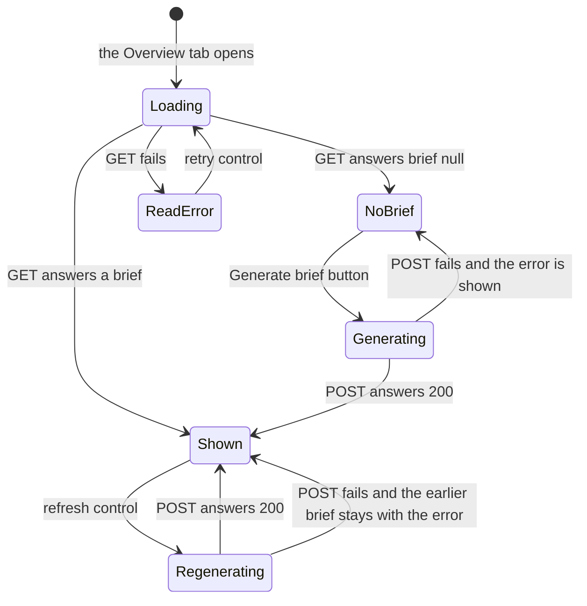
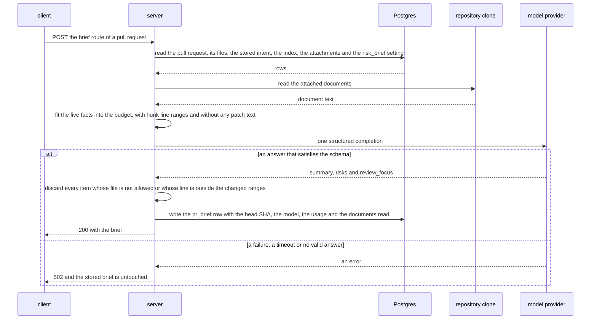

# Spec: PR Brief
Spec ID: SPEC-02
Status: approved
Supersedes: none

## Problem and user

A **reviewer** who opens somebody else's pull request starts cold: why the change exists,
what in it is risky and which file to read first are not on the page (IN-1). DevDigest
already answers parts of this, each in its own place: the Intent block says why and what
is in scope, the Blast radius block says what else the change reaches, the Files changed
tab groups files by role. A **repo owner** pays for every model call and picks the models
in Settings.

What is missing today, read at 8fcbda3 (IN-9, IN-10, IN-11):

- No short answer to "what does this pull request do and why". The Overview tab renders the
  Intent block, the Blast radius block and the description, and nothing else
  (`client/src/app/repos/[repoId]/pulls/[number]/_components/OverviewTab/OverviewTab.tsx:17`).
- Risks are not tied to code. The Intent block's risk areas are free-text chips without a
  file (`client/src/app/repos/[repoId]/pulls/[number]/_components/OverviewTab/_components/IntentCard/IntentCard.tsx:126`),
  and `specs/intent-layer.md` leaves file-anchored risks to this lesson.
- Nothing says which lines to read first, and nothing on the Overview tab leads to a file
  on the Files changed tab: the page URL knows only `tab` and `trace`
  (`client/src/app/repos/[repoId]/pulls/[number]/page.tsx:69`).
- The parts prepared for a brief are unused: the `PrBrief` contract is composed of intent,
  blast, risks and history and has neither a summary nor a review focus
  (`server/src/vendor/shared/contracts/brief.ts:151`); nothing reads or writes the
  `pr_brief` table (`server/src/db/schema/reviews.ts:84`); no caller resolves the
  `risk_brief` model row that Settings → Models shows
  (`server/src/vendor/shared/contracts/platform.ts:62`); the block labels wait in
  `client/messages/en/brief.json`.

The problem is known from the homework text (IN-1) and from the code read for this spec.

## Goals / Non-goals

Each goal carries the priority of the acceptance checklist (IN-7): P1 blocks the homework's
submission, P2 and P3 do not.

- **G-1** (P1) A reviewer on a pull request's Overview tab gets, on request, a PR Brief: a summary of what the pull request does and why, its risk areas each tied to a file, and a review focus list of `file:line` with a reason, shown together with the existing Intent and Blast radius blocks and with the list of attached documents the brief read.
- **G-2** (P1) Every file a brief names exists in the pull request or in its blast-radius map.
- **G-3** (P1) From a Review focus item the reviewer reaches that file on the Files changed tab.
- **G-4** (P1) The brief is kept per pull request: a reload shows it at once without a model call, and the reviewer regenerates it on demand.
- **G-5** (P2) One generation is one model call with the workspace's Risk Brief model, on an input that stays inside a fixed budget and holds no diff body, with an answer checked against the shared contract, and all of it visible: in the server log, and as the model, tokens and cost shown on the brief.
- **G-6** (P2) The reviewer sees when the brief was generated for an older head commit.
- **G-7** (P2) Every Review focus line is a line of a changed hunk of its file, and its item lands on that line in the diff.
- **G-8** (P3) The brief carries the extras of the design: the latest review's verdict and PR score, with its agent's name, above the summary, an expandable risk explanation, a way from a risk to its file, a notice for a file outside the diff, a skeleton during generation and an outline on the file a jump lands on.
- **NG-1** The model reading the diff: hunk bodies and any other source code of the pull request are not sent — the facts are already computed by Intent, Smart Diff and Blast Radius, and the brief stays one call inside a fixed input budget (IN-1).
- **NG-2** A second model call inside a generation, such as deriving a missing intent or summarising documents first — the model is called exactly once (IN-1); a missing fact is reported, not produced.
- **NG-3** Generating or regenerating without the reviewer's action: on page open, when a review runs, or when a new commit arrives — the checklist accepts a brief that is marked stale (P2-8), and reading a brief serves the cache only (IN-1).
- **NG-4** The "Prior PRs touching these files" list as a part of the brief, and writing the `history` field — the user: it is not needed for the brief; the list stays inside the Blast radius block as it is today.
- **NG-5** Fidelity to the frames beyond the named parts: the two-column composition, Risk areas drawn inside the Intent card, a different icon per risk kind, line ranges on risks, the count badge next to Review focus — the user accepts a plain list (IN-1).
- **NG-6** A new table, column or migration — the cache is the existing `pr_brief` row with the head SHA inside its JSON (IN-1).
- **NG-7** A new or changed MCP tool, and the brief as a section of the review prompt — neither is asked; the MCP tools and `reviewer-core/` stay as they are.
- **NG-8** The linked issue as a fact of its own — it is stored nowhere today and already reaches the brief through the intent; IN-1 names it only under "possible implementation", and the user decided against it (IN-13).
- **NG-9** The process deliverables of the homework: the pull request and its description, the demo video, the commit order of spec and plan, the cross-model review note, the plan-verifier report, the workflow retro and the cost report (P1-7, P1-8, P2-1, P2-2, P2-3, P3-7) — results of the process, tracked in `specs/pr-brief-acceptance.md`, not behaviour of the product.
- **NG-10** The findings of earlier reviews as a sixth fact — the user chose changed line ranges as the basis of a Review focus line, without findings (IN-13).
- **NG-11** A link to GitHub for a file outside the diff, and an on-screen line that announces the paid model call — the user declined both proposals (IN-13).

## User stories

- **US-1** As a reviewer, I want to see on the Overview tab whether a PR Brief exists and to start its generation with one button, so that I get oriented in an unfamiliar pull request before I read the diff.
- **US-2** As a reviewer, I want the brief to show a summary of what the pull request does and why next to the Intent and Blast radius blocks, so that I learn the purpose and the reach of the change in one place.
- **US-3** As a reviewer, I want each risk listed with its title and the file it concerns, so that I know where the change is dangerous.
- **US-4** As a reviewer, I want a review focus list of `file:line` entries, each with its reason, in reading order, so that I know where to start the review.
- **US-5** As a reviewer, I want every file the brief names to be a real file of the pull request or of its blast-radius map, so that I never chase a path the model made up.
- **US-6** As a reviewer, I want to activate a Review focus item and land on that file on the Files changed tab, so that I go from the advice to the code in one step.
- **US-7** As a reviewer, I want the brief to be there when I reload the page, so that I neither wait nor pay for it twice.
- **US-8** As a reviewer, I want a refresh control that generates the brief again, so that I update it after the pull request or its facts changed.
- **US-9** As a repo owner, I want one generation to be one bounded model call with the model I chose for Risk Brief, so that the cost of the feature is predictable and visible.
- **US-10** As a reviewer, I want to be told when the brief was generated for an older head commit, so that I do not trust advice about code that has changed since.
- **US-11** As a reviewer, I want a Review focus item to bring me to its line in the diff, so that I do not search the file for it.
- **US-12** As a reviewer, I want the latest review's verdict and PR score, with the name of the agent that gave them, above the brief's summary, so that I see an agent's conclusion and the brief together and know whose conclusion it is.
- **US-13** As a reviewer, I want to expand a risk and read its explanation, so that I understand why it is a risk.
- **US-14** As a reviewer, I want to activate a risk and land on its file on the Files changed tab, so that I inspect the risky code directly.
- **US-15** As a reviewer, I want a short notice when a brief item points at a file outside this pull request's diff, so that I know why no file opened.
- **US-16** As a reviewer, I want a skeleton in place of the brief while it is being generated, so that I see that work is in progress.
- **US-17** As a reviewer, I want to see which attached documents a brief read, so that I know which project knowledge it took into account.

The states of the PR Brief part of the Overview tab. "Shown" covers a fresh brief and a
stale one; a stale brief differs by its notice only (AC-53).



## Acceptance criteria (EARS)

Terms used below.

"The brief" is the stored PR Brief of one pull request: its `summary`, `risks` and
`review_focus`, the `intent` and `blast` it was generated from, and the head SHA of that
moment. "A generation" is the handling of one `POST /pulls/:id/brief` request. "The model
call" is one structured completion (`completeStructured`) of the provider adapter; a re-ask
that the adapter makes after an answer that fails the schema happens inside that one call.

"The facts" are the five inputs of a generation: the diff statistics, the stored intent,
the blast-radius map, the pull request's text (its stored title and description; the title
is included because a description is often empty, and the Intent module pairs the two the
same way), and the attached documents. IN-1 calls the last ones «спеки» and defines them as
the documents attached through Project Context, so documents of every type count: specs,
docs and insights.

"A PR file" is a file stored for the pull request, an entry of `files[]` in
`GET /pulls/:id`. "The blast-radius map" is what `GET /pulls/:id/blast` serves for the pull
request at the moment of the generation. "An allowed file" is the path of a PR file or,
when the brief's `blast` is not null, the file of a changed symbol or of a caller in that
map.

"A changed line range" is the new-side span of one hunk of a PR file's stored patch, read
from the start and the length in the hunk's header; a missing length counts as 1, and a
length of 0 gives no range. A range covers the added lines and the unchanged context lines
around them, which are exactly the new-side lines the Files changed tab renders for that
file. Only the numbers of a header are used, never the text that follows its second `@@`.
A PR file without patch text, and a file that is only in the blast-radius map, have no
range. "The validated answer" is the model's answer after the discards of AC-20 to AC-23
and AC-62.

"The PR Brief heading" opens the part of the Overview tab this feature adds; the summary
(inside its banner when AC-55 applies) or the empty state comes first under it, before the
Intent and Blast radius blocks. "The input budget" and "the input table" are under
Non-functional requirements (NFR-1) and Module interactions. Contracts are under Module
interactions.

Priority. A criterion has the priority of its goal's row in Traceability: G-1 to G-4 are
P1, G-5 to G-7 are P2, G-8 is P3. Criteria of origin `code` describe states the
neighbouring Intent and Blast radius blocks already have; they carry no checklist ID of
their own. The criteria of the proposals the user accepted (AC-63 and AC-66 to AC-68,
NFR-12; IN-13) carry none either; AC-64 and AC-65 come from an accepted proposal and
support P2-4. A criterion without a checklist ID does not block the homework's submission,
whatever row it stands in. The checklist ID behind each criterion is in the origin table
and in the map under Inputs and provenance.

- **AC-1** [event-driven] WHEN the reviewer opens the Overview tab of a pull request, the PR page shall show the heading "PR Brief" above every other block of the tab. — covers: US-1 · verify: component — the Overview tab rendered with a mocked brief response shows the heading from the `brief` namespace before the Intent and Blast radius headings in document order
- **AC-2** [state-driven] WHILE no brief is stored for the pull request, the PR page shall show the "Brief not available yet." text and a button labelled "Generate brief" under the PR Brief heading. — covers: US-1 · verify: component — a mocked `{ brief: null }` renders the text and one button with that name; a mocked brief renders neither
- **AC-3** [state-driven] WHILE the request for the stored brief is pending, the PR page shall show a loading placeholder under the PR Brief heading and no Generate brief button. — covers: US-1 · verify: component — with the request unresolved the placeholder is present and no button named "Generate brief" exists
- **AC-4** [unwanted] IF `GET /pulls/:id/brief` fails, THEN the PR page shall show an error message with a control that repeats the request. — covers: US-1 · verify: component — a rejected request renders the message; activating the control issues the request again
- **AC-5** [event-driven] WHEN the reviewer activates the Generate brief button, the PR page shall send one `POST /pulls/:id/brief` request. — covers: US-1 · verify: component — the mocked `fetch` receives exactly one POST to that route
- **AC-6** [state-driven] WHILE a `POST /pulls/:id/brief` request is pending, the PR page shall keep the Generate brief button and the refresh control disabled. — covers: US-1 · verify: component — while the mocked POST is unresolved the control on screen (the button without a brief, the refresh control with one) is disabled, and a second activation sends no request
- **AC-7** [event-driven] WHEN `POST /pulls/:id/brief` answers 200, the PR page shall show the returned brief's summary under the PR Brief heading, before the Intent and Blast radius blocks, and its Risk areas list and Review focus list on the same tab, without a page reload. — covers: US-2 · verify: component — after the mocked POST resolves, the summary text precedes the Intent heading in document order, a risk title and a `file:line` entry are on screen, and the router was not called
- **AC-8** [ubiquitous] The PR page shall show the Intent block and the Blast radius block on the Overview tab below the PR Brief heading, with a stored brief and without one. — covers: US-2 · verify: component — both existing blocks are rendered with `{ brief: null }` and with a brief
- **AC-9** [event-driven] WHEN a client requests `POST /pulls/:id/brief` for a pull request of the caller's workspace, the API shall answer 200 with a brief that holds a `summary` of at least one character, a `risks` list and a `review_focus` list. — covers: US-2 · verify: integration — with a mock provider answer that names PR files, the response is 200 and parses against the contract with a non-empty summary
- **AC-10** [unwanted] IF no intent is stored for the pull request when a generation starts, THEN the API shall generate the brief from the other facts and return it with `intent` set to null. — covers: US-2 · verify: integration — a seeded pull request without a `pr_intent` row returns 200 with `intent` null, and the provider's messages hold no intent section
- **AC-11** [unwanted] IF the pull request's blast-radius map holds no changed symbol when a generation starts, THEN the API shall generate the brief from the other facts and return it with `blast` set to null. — covers: US-2 · verify: integration — a pull request whose map has no changed symbol returns 200 with `blast` null, and the provider's messages hold no blast-radius section
- **AC-12** [ubiquitous] The API shall return in the brief's `intent` and `blast` the stored intent and the blast-radius map that the generation read. — covers: US-2 · verify: integration — with a seeded intent and an indexed caller, `intent.intent` equals the stored sentence and `blast.downstream` holds that caller
- **AC-13** [unwanted] IF the shown brief has `intent` or `blast` set to null, THEN the PR page shall name each missing fact in a notice under the PR Brief heading. — covers: US-2 · verify: component — a brief with both set to null renders a notice containing "Intent" and "Blast radius"; a brief with neither null renders no notice
- **AC-14** [ubiquitous] The PR page shall show each risk of the brief with its `title` and each path of its `file_refs`. — covers: US-3 · verify: component — two risks render two titles and all of their paths
- **AC-15** [ubiquitous] The PR page shall give each risk one icon whose colour is the colour assigned to the risk's `severity`. — covers: US-3 · verify: component — risks of the three severities render icons with three different colour tokens, and a risk of an unknown `kind` renders the same icon
- **AC-16** [unwanted] IF the brief holds no risk, THEN the PR page shall show the "No notable risks flagged." text in place of the Risk areas list. — covers: US-3 · verify: component — an empty `risks` renders the catalog text and no list item
- **AC-17** [state-driven] WHILE a brief is shown, the PR page shall leave the Intent block's own risk-area chips out. — covers: US-3 · verify: component — with an intent that has `risk_areas` and a brief, the chips are absent; with `{ brief: null }` they are present
- **AC-18** [ubiquitous] The PR page shall show each Review focus item as `file:line` followed by its `reason`, in the order of the brief's `review_focus`. — covers: US-4 · verify: component — three items render in the given order, each as path, colon, line and reason
- **AC-19** [unwanted] IF the brief holds no Review focus item, THEN the PR page shall show an empty-list text in place of the Review focus list. — covers: US-4 · verify: component — an empty `review_focus` renders the text and no list item
- **AC-20** [ubiquitous] The API shall discard from the model's answer each risk whose `title` is empty and each Review focus item whose `reason` is empty. — covers: US-3, US-4 · verify: unit — an answer with a risk of empty title and a focus item whose reason is whitespace loses both and keeps the rest
- **AC-21** [ubiquitous] The API shall remove from each risk of the model's answer each `file_refs` entry that equals no allowed file. — covers: US-5 · verify: unit — a risk with one PR file, one caller file of the blast-radius map and one invented path keeps the first two
- **AC-22** [unwanted] IF a risk of the model's answer is left with no `file_refs` entry, THEN the API shall discard that risk. — covers: US-5 · verify: unit — a risk whose every entry is invented and a risk with an empty `file_refs` are both dropped
- **AC-23** [ubiquitous] The API shall discard each Review focus item of the model's answer whose `file` equals no allowed file. — covers: US-5 · verify: unit — the file rule on its own keeps items naming a PR file and a caller file of the map, and drops an item naming an invented path and one differing from a PR file only in letter case
- **AC-24** [ubiquitous] The API shall store and return the validated answer only. — covers: US-5 · verify: integration — with a mock answer that mixes real and invented paths, neither the response nor the `pr_brief` row holds an invented path
- **AC-25** [ubiquitous] The PR page shall render each Review focus item as a link to the same pull request page whose query string holds `tab=diff`, the item's `file` as `file` and the item's `line` as `line`. — covers: US-6 · verify: component — each item is an anchor whose `href` holds `tab=diff`, the URL-encoded path and the line
- **AC-26** [event-driven] WHEN the PR page is shown with `tab=diff` and a `file` parameter equal to the path of a PR file, the PR page shall show that file's card expanded, inside an expanded role group, and scrolled into view. — covers: US-6 · verify: component — rendered with the parameter for a file of more than 200 changed lines in the docs group, the group and the card are open and `scrollIntoView` was called on the card; the same holds in the flat list when the grouping request failed
- **AC-27** [event-driven] WHEN the PR page expands a file's card for a `file` parameter, the PR page shall mark that card as the navigation target with a visible outline. — covers: G-8 · verify: component — only the target card carries the target marker
- **AC-28** [event-driven] WHEN the reviewer selects a tab in the tab bar, the PR page shall remove the `file` and `line` parameters from the URL. — covers: US-6 · verify: component — after a jump, selecting Overview and then Files changed calls the router with a URL that holds neither parameter
- **AC-29** [event-driven] WHEN a generation succeeds, the API shall store the brief in the pull request's one `pr_brief` row, in place of an earlier brief, with the pull request's stored head SHA inside the JSON. — covers: US-7 · verify: integration — after two successful generations the table holds one row for the pull request, its JSON is the second brief and its `head_sha` equals the pull request's
- **AC-30** [event-driven] WHEN a client requests `GET /pulls/:id/brief`, the API shall return the stored brief, or `brief` set to null when none is stored, without calling a model. — covers: US-7 · verify: integration — the mock provider records no call across the request; a pull request without a row gets 200 with `brief` null
- **AC-31** [event-driven] WHEN the reviewer opens the Overview tab of a pull request that has a stored brief, the PR page shall show that brief without sending a `POST /pulls/:id/brief` request. — covers: US-7 · verify: component — a mocked brief on the GET renders the summary, and the mocked `fetch` received no POST
- **AC-32** [unwanted] IF the JSON in a pull request's `pr_brief` row does not satisfy the brief contract, THEN the API shall answer `GET /pulls/:id/brief` with `brief` set to null. — covers: US-7 · verify: integration — a row holding an empty object gives 200 with `brief` null
- **AC-33** [unwanted] IF the pull request named in a brief route is not in the caller's workspace, THEN the API shall answer 404. — covers: US-7 · verify: integration — an unknown uuid on each of the two routes gives 404
- **AC-34** [unwanted] IF the `:id` of a brief route is not a uuid, THEN the API shall answer 422. — covers: US-7 · verify: integration — a malformed id on each of the two routes gives 422
- **AC-35** [state-driven] WHILE a brief is shown, the PR page shall show a refresh control next to the brief's summary. — covers: US-8 · verify: component — a control with an accessible name for refreshing is present with a brief and absent with `{ brief: null }`
- **AC-36** [event-driven] WHEN the reviewer activates the refresh control, the PR page shall send one `POST /pulls/:id/brief` request. — covers: US-8 · verify: component — the mocked `fetch` receives exactly one POST
- **AC-37** [event-driven] WHEN a client requests `POST /pulls/:id/brief` for a pull request that has a stored brief, the API shall answer with a newly generated brief and not with the stored one. — covers: US-8 · verify: integration — two POSTs give two provider calls, and the second response holds the second mock answer
- **AC-38** [state-driven] WHILE a regeneration is pending, the PR page shall keep the earlier brief on screen. — covers: US-8 · verify: component — while the mocked POST is unresolved the earlier summary stays on screen
- **AC-39** [unwanted] IF a generation fails, THEN the API shall leave the pull request's stored brief unchanged. — covers: US-8 · verify: integration — after a successful generation and a failing one, the GET still returns the first brief
- **AC-40** [unwanted] IF `POST /pulls/:id/brief` answers with an error, THEN the PR page shall show the error's message under the PR Brief heading and enable the control that started the request. — covers: US-8 · verify: component — a mocked 502 with a message renders that message, the earlier brief stays and the control is enabled
- **AC-41** [ubiquitous] The API shall build the model's input from five facts and no other pull request or repository data: the diff statistics, the stored intent, the blast-radius summary with its caller files, the pull request's title and description, and the attached documents. — covers: US-9 · verify: unit — the assembled user message holds exactly those sections; markers placed in a file's patch, in a commit message and in a finding title appear nowhere in the messages
- **AC-42** [ubiquitous] The API shall give as diff statistics, for each PR file, its path, its additions, its deletions and the Smart Diff role that `GET /pulls/:id/smart-diff` assigns to it. — covers: US-9 · verify: unit — a test file and a lockfile appear with the roles `tests` and `boilerplate` and with their additions and deletions
- **AC-43** [ubiquitous] The API shall take the attached documents from every agent of the caller's workspace, whether a document is attached to the agent directly or through a linked, enabled skill, and read each from the clone of the pull request's repository. — covers: US-9 · verify: integration — a document attached to one agent and another attached to an enabled skill linked to a second agent both appear in the provider's messages; a document of a disabled skill does not
- **AC-44** [unwanted] IF an attached document is not in the repository's document list, is unreadable or is empty, THEN the API shall generate the brief without that document. — covers: US-9 · verify: integration — with one attached path absent from the clone and one empty file, the response is 200 and the provider's messages hold neither
- **AC-45** [ubiquitous] The API shall make exactly one structured-completion call to the model provider for one generation. — covers: US-9 · verify: integration — one POST leaves exactly one `completeStructured` call on the mock provider, with a stored intent and without one
- **AC-46** [ubiquitous] The API shall send that call to the provider and model of the workspace's `risk_brief` setting, or to the registry default of `risk_brief` when the workspace has set none. — covers: US-9 · verify: integration — with `feature_models.risk_brief` set, the mock provider of that id receives that model; without it, the registry default
- **AC-47** [ubiquitous] The API shall request the model's answer against a schema of `summary`, `risks` and `review_focus` that is built from the shared brief contract. — covers: US-9 · verify: unit — the schema passed to the provider accepts a full sample and rejects one without `summary`, one with an empty `summary` and one with a `line` of 0
- **AC-48** [unwanted] IF the model call fails or ends without an answer that satisfies the schema, THEN the API shall answer 502. — covers: US-9 · verify: integration — a provider that throws, and a provider whose answer fails the schema, both give 502 and leave no row
- **AC-49** [unwanted] IF the model call does not finish within 60 seconds, THEN the API shall answer 502. — covers: US-9 · verify: unit — with a provider that never answers and fake timers, the generation rejects with the 502 error once 60 seconds have passed
- **AC-50** [unwanted] IF no key is configured for the resolved provider, THEN the API shall answer 400 with the code `brief_model_unavailable` and a message that names the Settings pages for keys and models. — covers: US-9 · verify: integration — with no key for the resolved provider the response is 400 with that code, and no provider call is made
- **AC-51** [unwanted] IF the five facts together exceed the input budget, THEN the API shall shorten them in the order of the input table, lowest priority first, until the input fits the budget. — covers: US-9 · verify: unit — with documents far above the budget only documents are shortened; with no document and a description far above it, the description is shortened next; the diff statistics are the last to lose entries
- **AC-52** [unwanted] IF the head SHA stored with a brief differs from the pull request's stored head SHA, THEN the API shall return that brief with `stale` set to true. — covers: US-10 · verify: integration — after the pull request's stored head SHA is changed, the GET returns the same brief with `stale` true; before the change `stale` is false
- **AC-53** [state-driven] WHILE the shown brief has `stale` set to true, the PR page shall show a notice that the pull request changed after the brief was generated. — covers: US-10 · verify: component — `stale` true renders the notice; `stale` false renders none
- **AC-54** [event-driven] WHEN the PR page is shown with `tab=diff`, a `file` parameter equal to the path of a PR file and a `line` parameter equal to a new-side line number rendered in that file's diff, the PR page shall scroll that line into view. — covers: US-11 · verify: component — with the parameters for a rendered line, `scrollIntoView` is called on that line's row; with a line that is not rendered it is called on the card only
- **AC-55** [state-driven] WHILE a brief is shown and the pull request has at least one review with a verdict, the PR page shall show the newest such review's verdict, PR score, finding count, blocker count and agent name in a banner above the brief's summary. — covers: US-12 · verify: component — with two mocked reviews the existing `VerdictBanner` shows the newer one's verdict, score, counts and agent name, and its summary text is the brief's; a review whose `agent_name` is null renders the banner without a name; a newer review whose `verdict` is null is passed over
- **AC-56** [unwanted] IF the pull request has no review with a verdict, THEN the PR page shall show the brief's summary without a verdict and without a PR score. — covers: US-12 · verify: component — with no review, and with one review whose `verdict` is null, the summary is rendered and neither a verdict label nor a score is present
- **AC-57** [event-driven] WHEN the reviewer activates a risk's expand control, the PR page shall show that risk's `explanation` under its title. — covers: US-13 · verify: component — the explanation is absent before the activation and present after it; a second activation hides it
- **AC-58** [ubiquitous] The PR page shall render each `file_refs` path of a risk as a link to the same pull request page whose query string holds `tab=diff` and that path as `file`. — covers: US-14 · verify: component — each path of a risk is an anchor whose `href` holds `tab=diff` and the URL-encoded path
- **AC-59** [unwanted] IF the PR page is shown with `tab=diff` and a `file` parameter that equals the path of no PR file, THEN the PR page shall show the notice "File not in this PR's diff" above the file list. — covers: US-15 · verify: component — rendered with a `file` that matches no file, the notice is present and no card is marked; with a matching file it is absent
- **AC-60** [state-driven] WHILE the first generation of a pull request's brief is pending, the PR page shall show a skeleton where the brief's content will appear. — covers: US-16 · verify: component — while the mocked first POST is unresolved a skeleton is rendered under the heading
- **AC-61** [ubiquitous] The API shall add to the diff statistics, for each PR file, its changed line ranges, taken from the line numbers of the hunk headers of its stored patch and from nothing else of the patch. — covers: US-9 · verify: unit — a patch with two hunks yields two ranges with the headers' new-side start and length; a header without a length yields a one-line range, a new-side length of 0 yields none, a file without a patch yields none, and the text after a header's second `@@` appears nowhere in the messages
- **AC-62** [ubiquitous] The API shall discard each Review focus item of the model's answer whose `line` lies in no changed line range of its `file`. — covers: US-11 · verify: unit — an item on the first line and one on the last line of a hunk's range stay; an item one line past the range, an item on a PR file without a patch and an item on a file that is only in the blast-radius map go
- **AC-63** [event-driven] WHEN the reviewer follows the link of a Review focus item or of a risk path, the PR page shall add an entry to the browser history. — covers: US-6 · verify: component — following a link calls the router's `push` and not its `replace`, so that Back leads to the URL of the Overview tab
- **AC-64** [event-driven] WHEN a generation succeeds, the API shall store with the brief, and return, the provider and model of its model call, the provider-reported input and output tokens and the cost. — covers: US-9 · verify: integration — the response and the stored JSON hold the resolved provider and model and the mock provider's token and cost figures; a model without a price gives `cost_usd` null
- **AC-65** [state-driven] WHILE a brief is shown, the PR page shall show the brief's model, its input and output token counts and its cost next to the summary. — covers: US-9 · verify: component — a brief with 8200 and 1300 tokens and a cost renders the model name, both counts with group separators and the cost; a null cost renders the model and the counts without a cost
- **AC-66** [ubiquitous] The API shall resolve the `risk_brief` feature model of a workspace that has set none to the provider `openrouter` and to a model that has an entry in the server's price table. — covers: US-9 · verify: integration — a fresh workspace resolves `risk_brief` to `openrouter` and to a model for which the price table returns a cost; the assertion at `server/test/settings-models.it.test.ts:54` follows the new default
- **AC-67** [event-driven] WHEN a generation succeeds, the API shall store with the brief, and return, the paths of the attached documents whose text was part of the model's input, in input order. — covers: US-17 · verify: integration — with two attached documents read and one skipped as missing, `documents_read` holds the two paths in the order of the document list and not the third
- **AC-68** [state-driven] WHILE the shown brief has at least one read document, the PR page shall list the paths of those documents under the summary. — covers: US-17 · verify: component — two paths render as two entries of plain text; an empty `documents_read` renders no list

## Edge cases

- **EC-1** No intent is stored for the pull request → the brief is generated from the other facts, `intent` is null and the page names Intent as missing — covered by: AC-10, AC-13
- **EC-2** The blast-radius map holds no changed symbol (no index, a failed or switched-off index, a change that touches no indexed symbol, or no stored PR file) → `blast` is null, the page names Blast radius as missing, and only PR files are allowed files — covered by: AC-11, AC-13, AC-23
- **EC-3** The stored intent was derived for an older head commit → it is used as stored; a generation never starts a derivation — covered by: AC-45
- **EC-4** No file is stored for the pull request, because its detail was never loaded → there are no diff statistics and no allowed PR file, each item that names a file is discarded, and the brief holds its summary and two empty lists — covered by: AC-23, AC-16, AC-19
- **EC-5** The pull request changes more than 100 files → only the first 100 are stored, because the GitHub adapter reads one page (`server/src/adapters/github/octokit.ts:86`); the allowed files and the Files changed tab both use the stored ones — covered by: AC-23
- **EC-6** The blast-radius map and the attached documents show the repository at the commit of its last resync, not at the pull request's head (`INSIGHTS.md`, § What Doesn't Work) → a caller file or a document that the pull request itself changes is read in its earlier state — covered by: AC-43, AC-23
- **EC-7** The model names a path that differs from an allowed file in letter case, by a leading `./` or by a `:line` suffix → it equals no allowed file and is removed — covered by: AC-21, AC-23
- **EC-8** Every risk and every Review focus item is discarded → the brief is stored with its summary, and both lists show their empty texts — covered by: AC-24, AC-16, AC-19
- **EC-9** The model answers with a Review focus `line` outside every changed line range of its file, which the ranges in its input do not prevent → the item is discarded — covered by: AC-62
- **EC-10** An item's file is an allowed file only through the blast-radius map (a caller outside the pull request) → a risk keeps such a path, and its link shows the not-in-diff notice; a Review focus item on such a file has no changed line range and is discarded, so Review focus names PR files only — covered by: AC-21, AC-59, AC-62
- **EC-11** The target file's card starts collapsed (more than 200 changed lines, `client/src/components/diff-viewer/constants.ts:4`) or its role group starts collapsed (docs, boilerplate) → both are expanded — covered by: AC-26
- **EC-12** The target file has no patch text (binary, or too large for GitHub to return) → its card is expanded and shows the existing no-diff text; no line is scrolled to — covered by: AC-26
- **EC-13** The Smart Diff grouping is still loading, or failed, when the target arrives → the target is applied to the file list that is on screen once files are rendered — covered by: AC-26
- **EC-14** A new commit lands after the brief was generated → the brief is returned with `stale` true once the PR list sync has refreshed the stored head SHA; a file that commit removed leads to the not-in-diff notice, and a line that left the diff leads to the file's card without a line scroll — covered by: AC-52, AC-53, AC-59, AC-54
- **EC-15** A fact changes without a new commit (the intent is re-derived, the index is rebuilt, the description is edited, a document is attached, another model is picked) → the brief is not marked stale; the refresh control regenerates it — covered by: AC-37, AC-52
- **EC-16** Two generations of one pull request run at the same time (two tabs) → each makes its own model call, and the row holds the brief that finished last — covered by: AC-29
- **EC-17** The reviewer leaves the Overview tab or the page while a generation runs → the API finishes and stores the brief; on return the page shows what the GET answers at that moment, and a second activation is a second call inside the rate limit — covered by: AC-29, AC-31, NFR-4
- **EC-18** The model provider is slow, down, or answers with JSON that fails the schema → 502, the earlier brief stays stored and on screen, the error is shown and the control is enabled again — covered by: AC-48, AC-49, AC-39, AC-40
- **EC-19** No key is configured for the resolved provider, for example a workspace without an OpenRouter key that never picked another Risk Brief model → 400 with a message that names the Settings pages — covered by: AC-50
- **EC-20** An attached document is absent from the pull request's repository, unreadable or empty, or the repository has no clone → that document is skipped and the generation goes on — covered by: AC-44
- **EC-21** The attached documents alone exceed the budget (one spec of this repository is about 78 KB) → documents are shortened first and the other four facts stay whole — covered by: AC-51, NFR-1
- **EC-22** The facts without documents already exceed the budget (hundreds of files, a long description) → they are shortened by priority, the diff statistics last — covered by: AC-51, NFR-1
- **EC-23** The model answers with an empty summary → the answer fails the schema, the adapter re-asks, and a second failure ends in 502 — covered by: AC-47, AC-48
- **EC-24** The model returns the same item twice, or dozens of items → every item that passes the checks is kept, in the model's order; no cap applies — covered by: AC-18, AC-24
- **EC-25** The JSON in a `pr_brief` row does not satisfy the contract (a row written by hand, or before a later contract change) → the GET answers `brief` null and the page shows the empty state — covered by: AC-32, AC-2
- **EC-26** The pull request belongs to another workspace, or the id is unknown or malformed → 404, or 422 for a malformed id — covered by: AC-33, AC-34
- **EC-27** Several agents reviewed the pull request → the newest review is the run that finished last, one agent's opinion (`server/INSIGHTS.md`, § Codebase Patterns); the banner names that agent, so the reviewer sees whose verdict it is — covered by: AC-55
- **EC-28** A brief exists and no review has run → the summary is shown without verdict and score — covered by: AC-56
- **EC-29** The `file` or `line` parameter is written by hand (another repository's path, markup, a negative number) → it is compared as text with PR file paths and rendered line numbers; without a match the notice is shown, and the value is never inserted as markup — covered by: AC-59, NFR-6
- **EC-30** The reviewer comes back to the Files changed tab through the tab bar after a jump → the tab opens from the top, without repeating the jump — covered by: AC-28
- **EC-31** A fourth generation is requested within a minute → 429, shown as an error under the heading — covered by: NFR-4, AC-40
- **EC-32** The Intent block has its own risk-area chips and the brief has a Risk areas list → while a brief is shown the chips are left out, and the tab holds one list under that name — covered by: AC-17
- **EC-33** A risk's `kind` is any text the model wrote → every risk gets the same icon, coloured by severity — covered by: AC-15
- **EC-34** A PR file has no patch text (binary, or too large for GitHub to return), or only hunks whose new side is empty (a deleted file) → it has no changed line range; a Review focus item on it is discarded, and a risk is still free to name it — covered by: AC-61, AC-62
- **EC-35** A hunk header carries source text after its second `@@` (the line of the enclosing function) → only the header's numbers enter the input — covered by: AC-61, NFR-2
- **EC-36** The newest review has no verdict, or its agent no longer exists so that `agent_name` is null → a review without a verdict is passed over for the newest one that has one, as the Agent runs tab shows a banner only for a review with a verdict; a missing name leaves the banner without a name — covered by: AC-55, AC-56
- **EC-37** The model of a generation has no price → `cost_usd` is null, and the brief shows its model and token counts without a cost — covered by: AC-64, AC-65
- **EC-38** No document is attached, every attached one is skipped, or the budget leaves all of them out → `documents_read` is empty and the brief shows no document list — covered by: AC-67, AC-68
- **EC-39** A document is cut to fit the budget → its path is listed, since part of its text was sent; a document that the budget leaves out whole is not listed — covered by: AC-67, AC-51
- **EC-40** The reviewer presses Back after a jump → the browser returns to the Overview tab, where the stored brief is shown again without a model call — covered by: AC-63, AC-31

## Non-functional requirements

- **NFR-1** [cost] The system message and the user message that the API assembles for a generation hold together at most 8 000 tokens, counted by the server's tokenizer (`cl100k_base`) before the call is made; the provider's reported input tokens are logged beside that count and are not the measure, because a provider adds the answer schema and tokenises differently, and messages of an adapter's re-ask are outside the count — verify: unit — facts far above the budget (documents of 100 000 characters, 500 files, a description of 20 000 characters) yield messages that count to 8 000 or fewer with the same tokenizer; the log line of NFR-7 carries both numbers
- **NFR-2** [cost] No text of a stored file's `patch` is part of any message sent to the model: no line of a hunk body, and nothing of a hunk header beyond its line numbers — verify: unit — markers placed in a patch's added line, in a context line and in the text after a header's second `@@` are found in none of the messages the mock provider received
- **NFR-3** [cost] Reading a brief spends nothing: `GET /pulls/:id/brief` makes no model call, no GitHub request and no read from the clone; the PR page sends `POST /pulls/:id/brief` only when the Generate brief button or the refresh control is activated, never when the Overview tab opens, and never repeats a failed one by itself — verify: integration — the mock provider and the mock GitHub client record no call across a GET; component — no POST on mount, and no second POST after a failed one
- **NFR-4** [cost] `POST /pulls/:id/brief` accepts at most 3 requests per minute, the limit `POST /pulls/:id/intent/derive` has, and the model call allows at most one re-ask after an answer that fails the schema — verify: the route's declared limit and the call's retry setting are read in review; the limit is inert under `NODE_ENV=test`, so a fourth request within a minute is tried by hand against a dev stack and answers 429
- **NFR-5** [security] Every fact reaches the model only inside untrusted-data blocks of the user message; the system message holds no text taken from the pull request, the repository, a document or an earlier model answer — verify: unit — markers placed in the title, the description, the intent, a file path and a document are found inside untrusted blocks of the user message and nowhere in the system message
- **NFR-6** [security] The PR page renders the brief's `summary`, each risk `title`, `kind`, `explanation` and path, each `reason` and each path of `documents_read` as plain text, with no HTML and no Markdown taken from them, and builds no link from model text except the in-app links of AC-25 and AC-58, whose `file` value is URL-encoded — verify: component — strings holding a script element and a Markdown link render as visible text, and a path with a space and an ampersand arrives intact in the `href`
- **NFR-7** [observability] Each generation writes one `prompt.assembled` log line with the purpose `brief`, carrying section names and sizes and never text, and one `info` line with the pull request id, provider, model, the counted input tokens, the budget, the adapter's `attempts`, the provider's tokens in and out, the numbers of risks and Review focus items kept and discarded, and the duration; a read writes neither line, and the `info` line is written whatever `PROMPT_LOG` is set to — verify: unit with a capturing log sink — one generation yields exactly one line of each kind with those fields, and a GET yields none
- **NFR-8** [compatibility] `summary` and `review_focus` are added to `PrBrief` in both `@devdigest/shared` copies and the two `brief.ts` files stay identical; the brief record of the two routes is declared in both copies as well; no table, column or migration is added; the responses of the existing pulls, intent, blast, smart-diff and reviews routes are unchanged; no MCP tool changes — verify: typecheck in server and client; a byte comparison of the two files; `drizzle-kit generate` reports no schema change; the existing server, client and mcp suites stay green
- **NFR-9** [compatibility] The feature extends what the starter pre-wires (the `PrBrief` contract, the `pr_brief` table, the `risk_brief` row of the model registry, the `brief` message namespace) and adds no second contract, table, registry row or namespace for the same data — verify: review of the diff against the files of IN-9 and IN-11
- **NFR-10** [i18n] Every visible string the feature adds comes from `client/messages/<locale>/`; the block headings and the texts IN-1 lists are read from `client/messages/en/brief.json`, where the heading of the risk list reads "Risk areas" and the hint under "Brief not available yet." names the Generate brief button instead of a review run; counts use ICU plural forms, and token counts are typed ICU numbers, so that 8200 renders with a group separator — verify: component — tests render through the message catalog and assert "8,200", and the new components hold no string literal
- **NFR-11** [accessibility] Every item that navigates (a Review focus item, a risk path of AC-58) is a link; the Generate brief button, the refresh control and each risk's expand control are buttons; each is reachable and operable from the keyboard and has an accessible name, the refresh control's stating the action and an expand control's stating its risk and its expanded state; a risk's severity is available as text and not by colour alone — verify: component — each control is found by role and name, an expand control exposes `aria-expanded`, and the severity word is in the icon's accessible name
- **NFR-12** [compatibility] The `risk_brief` default is the same provider and model in the three copies of the model registry: the two `@devdigest/shared` copies of the platform contract and the client's own registry in `client/src/lib/feature-models.ts`, which Settings → Models reads — verify: review of the three files; the server test of AC-66 and a client test that reads the Risk Brief row of the client registry assert the same pair

## Module interactions

Packages: server, client
Surfaces: the Overview tab of the PR page (the PR Brief heading with the summary or the empty state, the Risk areas list, the Review focus list, beside the existing Intent and Blast radius blocks); the Files changed tab of the PR page (a target file and line taken from the URL, the not-in-diff notice); the routes `GET /pulls/:id/brief` and `POST /pulls/:id/brief`; the `PrBrief` contract in both `@devdigest/shared` copies; the `pr_brief` row; the `risk_brief` default of the model registry, which Settings → Models shows; the server log.

| # | From → To | Channel | Carries | Exists today | If it fails |
|---|---|---|---|---|---|
| MI-1 | client → server | `GET /pulls/:id/brief` | the brief record, or null | new | the error state with a retry control (AC-4) |
| MI-2 | client → server | `POST /pulls/:id/brief` | no body in; the new brief record out | new | the error message under the heading; an earlier brief stays (AC-38, AC-40) |
| MI-3 | server, brief generation → server, intent data | in-process read of the stored intent | the sentence and the two scope lists | yes (`server/src/modules/intent/repository.ts:15`; a derivation writes the row at `server/src/modules/intent/service.ts:217`) | no row: the brief is generated without the intent (AC-10) |
| MI-4 | server, brief generation → server, blast radius | in-process: the map that `GET /pulls/:id/blast` serves | changed symbols, callers with file and line, the summary sentence | yes (`server/src/modules/blast/service.ts:24`; it answers with an empty map instead of an error when data is missing) | a map without a changed symbol: the brief is generated without blast radius (AC-11) |
| MI-5 | server, brief generation → server, pull request data | in-process read | the title, the description and the stored head SHA; per stored file its path, additions, deletions and the line numbers of the hunk headers of its patch; the Smart Diff role of each path | yes (`server/src/modules/pulls/repository.ts:98` and `:204`; files are written with their patch when `GET /pulls/:id` reaches GitHub, `server/src/modules/pulls/service.ts:145`; roles come from `server/src/modules/smart-diff/classify.ts`) | no stored file: no diff statistics and no allowed PR file (EC-4) |
| MI-6 | server, brief generation → server, Project Context | in-process read | the paths attached to any agent of the workspace, directly or through a linked, enabled skill | changes (`server/src/modules/context/repository.ts:74` returns every path and agent pair of the workspace; documents are resolved for one agent only, `server/src/modules/context/service.ts:110`) | no attachment: the brief is generated without documents |
| MI-7 | server → repository clone on disk | file read inside the clone | the text of the attached documents that the repository's document list holds | yes (`server/src/modules/context/service.ts:121`) | a document that is missing, unreadable or empty is skipped (AC-44) |
| MI-8 | server → workspace settings | the feature-model lookup for `risk_brief` | provider and model | changes (`server/src/modules/settings/feature-models.ts:50` resolves it today and no caller asks for it yet; the registry row at `server/src/vendor/shared/contracts/platform.ts:62` and its copies get an OpenRouter default, AC-66 and NFR-12) | no override: the registry default (AC-46) |
| MI-9 | server → model provider | one structured completion | the system message, the user message with the facts, the answer schema | new | 400 without a key, 502 on failure, timeout or an answer that fails the schema (AC-48, AC-49, AC-50) |
| MI-10 | server → Postgres | the pull request's `pr_brief` row | the brief JSON with `head_sha` | new — the table exists since the first migration (`server/src/db/schema/reviews.ts:84`) and nothing reads or writes it | a failed write fails the request; a row that does not satisfy the contract reads as no brief (AC-32) |
| MI-11 | client, Overview tab → client, Files changed tab | the PR page URL | `tab=diff`, `file`, `line`, followed as a new browser history entry | changes (`tab` is read at `client/src/app/repos/[repoId]/pulls/[number]/page.tsx:69` and written by replacing the history entry at `:75`; `file`, `line` and the new entry of AC-63 are added) | a `file` that matches no PR file shows the notice (AC-59) |
| MI-12 | client → server | the existing `GET /pulls/:id`, `GET /pulls/:id/reviews`, `GET /pulls/:id/intent`, `GET /pulls/:id/blast` and `GET /pulls/:id/smart-diff` | the PR files of the Files changed tab; the reviews of the banner, each with its `verdict`, `score`, findings and `agent_name`; the two existing blocks | yes (`client/src/lib/hooks/reviews.ts:70`, `client/src/lib/hooks/intent.ts:13`; a review's `agent_name` is filled from the agents of the workspace at `server/src/modules/reviews/service.ts:181`, and is null when the agent is gone) | unchanged |
| MI-13 | mcp → server | the existing routes | unchanged; no tool reads or starts a brief | yes (`mcp/src/api/http-client.ts:211`) | unchanged |

What each side may rely on:

- The server owns the brief. The client never builds or edits one; it shows the last
  response and asks again whenever the Overview tab is mounted, as the Intent block does.
- A stored brief is self-contained: its `intent` and `blast` are the facts of its own
  generation, so its allowed files are checkable from the response and the PR files alone,
  even after the index or the intent has moved on.
- Nothing of the model's answer is stored or returned before the discards of AC-20 to
  AC-23 and AC-62 have run (AC-24). The model's answer is untrusted input, like any request
  body.
- Every stored Review focus item names a PR file and a line inside a changed line range of
  that file, as the file was stored when the brief was generated. After a later commit the
  line may have left the diff (EC-14).
- The provider, model, tokens, cost and `documents_read` of a brief describe its own
  generation and never change afterwards; `stale` is the only field computed on a read.
- Reading costs one row. The GET calls no model, no GitHub and no clone.
- The client treats the response as typed data and does not parse it with the Zod contract:
  the vendored package is type-only in the client build (`client/INSIGHTS.md`,
  § Recurring Errors).
- The Files changed tab owns the meaning of `file` and `line`: it compares them with the
  files and lines it renders. The Overview tab only writes them into links.
- The existing routes and the MCP tools keep their responses.

One generation:



Contracts. Wire JSON is snake_case; every change lands in both `@devdigest/shared` copies.

```text
GET /pulls/:id/brief                          → 200   never calls a model
  { brief: <brief record> | null }            null when no brief is stored, or when the stored
                                              JSON does not satisfy the contract (AC-32)

POST /pulls/:id/brief                         → 200   one generation, one model call
  no body
  { brief: <brief record> }                   the newly generated brief, already stored

brief record — the PrBrief fields, plus (declared in both copies)
  pr_id:           string
  head_sha:        string          the pull request's stored head SHA when the brief was
                                   generated; kept inside the stored JSON
  stale:           boolean         computed on every read: head_sha differs from the pull
                                   request's stored head SHA (AC-52); not stored
  provider:        string          the provider and the model of the generation's
  model:           string          model call (AC-64)
  tokens_in:       integer         as the provider reported them, summed over the
  tokens_out:      integer         adapter's attempts (AC-64)
  cost_usd:        number | null   null when the model has no price (EC-37)
  documents_read:  string[]        paths of the attached documents whose text was part of
                                   the input, in input order; empty when none (AC-67)

PrBrief (both copies of contracts/brief.ts)
  summary:       string, at least 1 character              new
  review_focus:  { file: string,                           new; in reading order
                   line: integer, 1 or more,               a line number in the head version of the file,
                   reason: string }[]                      inside a changed line range of that file (AC-62)
  risks:         { risks: Risk[] }                         exists, unchanged
  intent:        Intent | null                             changes: nullable — null when no intent was
                                                           stored (AC-10); otherwise the stored intent (AC-12)
  blast:         BlastRadius | null                        changes: nullable — null when the map held no
                                                           changed symbol (AC-11); otherwise that map (AC-12)
  history:       PrHistory                                 changes: optional — this feature does not write it (NG-4)

Risk (exists, unchanged)
  kind: string    title: string    explanation: string
  severity: "high" | "medium" | "low"
  file_refs: string[]                                      repository-relative paths, no line part (AC-21)

the model's answer — the schema of the one call (AC-47)
  summary:       string, at least 1 character
  risks:         Risk[]
  review_focus:  as in PrBrief

errors, both routes
  404  the pull request is not in the caller's workspace (AC-33)
  422  :id is not a uuid (AC-34)
errors, POST only
  400  brief_model_unavailable — no key for the resolved provider (AC-50)
  429  more than 3 requests in a minute (NFR-4)
  502  the model call failed, timed out, or gave no answer that satisfies the schema;
       nothing is stored (AC-48, AC-49)

PR page URL (inside the client)
  ?tab=diff&file=<path, URL-encoded>&line=<integer>        line is optional (AC-25, AC-58); a link is
                                                           followed as a new history entry (AC-63), and
                                                           the tab bar removes file and line (AC-28)

model registry (three copies: both @devdigest/shared copies and the client's own)
  risk_brief default   provider "openrouter" and a model that has an entry in the server's
                       price table (AC-66), the same in the three copies (NFR-12);
                       which model is OQ-13

the input table — one system message with fixed instructions, and one user message
with the facts, each inside an untrusted-data block (NFR-5)

  priority  fact                content                                             shortened by
  1         diff statistics     per PR file: path, additions, deletions, role and   the files with the fewest changed
                                its changed line ranges (AC-42, AC-61)              lines leave first, each with its ranges
  2         intent              the sentence, the in-scope and out-of-scope lists   the lists from their ends, the
                                                                                    sentence last
  3         blast radius        the map's summary and the paths of its caller files caller files from the end of the
                                                                                    map's order
  4         pull request text   the stored title and description                    the description from its end
  5         attached documents  the path and text of each document, in the order    documents from the end of the list;
                                of the repository's document list                   the last one kept is cut to what fits

  Shortening goes from priority 5 to priority 1, and a fact is touched only when every
  fact of lower priority is already empty (AC-51). A fact that is null or absent has no
  section in the message (AC-10, AC-11). No text of a patch is in any fact: a hunk
  contributes the line numbers of its header and nothing else (AC-61, NFR-2). The discards
  of AC-21 to AC-23 and AC-62 use every PR file and every range, whether or not the budget
  left the file in the message.
```

## Design review

Sources reviewed: IN-2, IN-3, IN-4, IN-5, IN-6

| # | Kind | Finding | Proposal | Decision |
|---|---|---|---|---|
| DR-1 | inconsistency | IN-2's summary and its Review focus reasons ("live Stripe key … committed in plaintext" at `src/config.ts:12`) repeat the findings that IN-3 and IN-6 draw in the diff; only a diff body or stored findings hold that knowledge, and IN-1 gives the model neither | Add the current findings (file, line, severity and title of the newest review per agent) as a sixth fact | rejected — the user chose changed line ranges without findings as a fact (IN-13, NG-10) |
| DR-2 | corner case | IN-1 has the model return a `line` without reading the diff, and no fact of IN-1 carries a line of a PR file; the lines of IN-2 are exactly changed lines | Add each PR file's changed line ranges to the diff statistics (hunk headers only, no bodies) and discard a Review focus item whose line lies outside them | accepted → AC-61, AC-62 |
| DR-3 | inconsistency | IN-2 and IN-5 draw each risk with a path and a line range (`src/middleware/ratelimit.ts:12-18`); IN-1 asks for a file per risk, and `file_refs` is a list of plain strings | Plain paths; a line part is not accepted | accepted → AC-21, AC-22 |
| DR-4 | inconsistency | IN-2 draws Risk areas inside the Intent card, where the Intent block renders its own "Risk areas" chips today (`client/src/app/repos/[repoId]/pulls/[number]/_components/OverviewTab/_components/IntentCard/IntentCard.tsx:126`); `specs/intent-layer.md` expects this lesson to replace them | While a brief is shown the chips are not rendered, so the tab holds one Risk areas list | accepted → AC-17 |
| DR-5 | inconsistency | IN-2's banner shows one verdict and one score "from the latest review"; a review row exists per agent run, so the newest row is whichever agent finished last (`server/INSIGHTS.md`, § Codebase Patterns), and the frame carries no agent name | The newest review, with the name of its agent on the banner | accepted → AC-55 |
| DR-6 | missing state | No frame shows the tab before a brief exists; IN-1 gives the button, and the pre-wired hint "Run a review or open the PR to compute it." (`client/messages/en/brief.json:12`) names two actions that compute no brief | The empty state with the pre-wired "Brief not available yet." text, a hint reworded to name the button, and the Generate brief button | accepted → AC-2, NFR-10 |
| DR-7 | missing state | No frame shows the load on page open, a generation in progress, a failed read, a failed generation, a stale brief, missing facts, or an empty Risk areas or Review focus list | The states the Intent and Blast radius blocks already have (placeholder, inline error with the API's message, retry), and the texts IN-1 names | accepted → AC-3, AC-4, AC-6, AC-13, AC-16, AC-19, AC-38, AC-40, AC-53, AC-60 |
| DR-8 | missing state | IN-2 shows the banner of a reviewed pull request only; a brief on a pull request that was never reviewed is not drawn | The summary alone, without verdict and score, since IN-1 makes only the summary mandatory | accepted → AC-56 |
| DR-9 | inconsistency | IN-2's banner has an info icon next to the finding count; IN-1 does not mention it and `VerdictBanner` has no such part | Take the icon into this feature | rejected — no source says what it opens |
| DR-10 | ux | IN-2's banner shows "$0.014 8.2K→1.3K" under the score; IN-1 does not list it, and a brief has no run trace where its cost could be read | Store the generation's provider, model, tokens and cost with the brief and show them as the Intent block shows its own | accepted → AC-64, AC-65 |
| DR-11 | inconsistency | The 8.2K input tokens of IN-2's banner lie above the 8 000-token example of IN-1: a provider counts the answer schema and tokenises in its own way | Measure the budget on the server before the call and log the provider's number beside it | accepted → NFR-1, NFR-7 |
| DR-12 | corner case | IN-3 and IN-6 show the target in an open group with an open card; a target in a collapsed group, in a card that starts collapsed, without patch text, or outside the diff is not drawn | Expand the group and the card; show the notice of IN-1 for a file outside the diff | accepted → AC-26, AC-59 |
| DR-13 | ux | Tabs change with `router.replace` (`client/src/app/repos/[repoId]/pulls/[number]/page.tsx:75`), so after a Review focus jump the browser's Back button leaves the pull request instead of returning to the Overview tab | Push a history entry for the jump, so that Back returns to the brief | accepted → AC-63 |
| DR-14 | ux | Neither a frame nor IN-1 says on screen that Generate brief and the refresh control start a paid model call; the Intent block's Derive button does not say it either | A line next to the button that names the Risk Brief model and says that one model call is made | rejected — the user declined it (IN-13, NG-11) |
| DR-15 | module | Documents are attached to agents and skills (`specs/2026-10-04-project-context.md`), and a brief has no agent; IN-1 speaks of documents attached "to the reviewer" | Read the documents of every agent of the workspace | accepted → AC-43 |
| DR-16 | module | IN-1 lists the linked issue under "possible implementation" only; the issue is resolved live by the GitHub adapter and stored nowhere (`server/src/adapters/github/octokit.ts:98`, `server/src/modules/pulls/helpers.ts:37`) | Not a fact of its own; it reaches the brief through the intent | accepted → AC-41 |
| DR-17 | module | The registry default of `risk_brief` is `openai` with `gpt-4.1`, while Settings → Models offers OpenRouter models only (`INSIGHTS.md`, § Codebase Patterns): a workspace with only an OpenRouter key gets the missing-key error until a model is picked | Change the default to an OpenRouter model in the three registry copies, together with the assertion at `server/test/settings-models.it.test.ts:54` | accepted → AC-66, NFR-12 |
| DR-18 | module | IN-1 names `getIntent(prId)` in `server/src/modules/reviews/repository.ts`; that method was removed and the intent module owns `pr_intent` (`server/src/modules/intent/repository.ts:8`) | Read the stored intent through the intent module, as IN-1 itself says to look in the fork first | accepted → AC-10 |
| DR-19 | corner case | No source caps the number of risks or of Review focus items; the Intent module caps its own lists | Cap both lists | rejected — no source gives a number; every item that passes the checks is kept (EC-24) |
| DR-20 | ux | IN-1 and IN-2 carry a risk's severity by the icon's colour alone | The severity word in the icon's accessible name, as the diff's line labels pair an icon with a word | accepted → NFR-11 |
| DR-21 | ux | An item whose file is only in the blast-radius map ends at the not-in-diff notice; the Blast radius block links its callers to GitHub at the indexed commit | Link such an item to the file on GitHub at that line | rejected — the user declined it (IN-13, NG-11) |
| DR-22 | ux | The reviewer cannot see which attached documents a brief read, although IN-1 wants the demo to show that a spec was taken into account; a run trace lists its documents as `specs_read` | Keep the paths of the documents a generation read in the brief and list them under the summary | accepted → AC-67, AC-68 |
| DR-23 | corner case | The reviewer leaves the Overview tab while a generation runs; the API has no in-flight state for a brief, so on return the tab shows the empty state or the earlier brief until the stored result arrives | A server-side "generating" state | rejected — it is not asked; the running generation still stores its brief, and a second activation is bounded by the rate limit (EC-17) |
| DR-24 | inconsistency | The frames and IN-1 title the list "Risk areas"; the pre-wired key `block.risks` reads "Risks" (`client/messages/en/brief.json:5`) | The heading reads "Risk areas" and comes from the `brief` namespace | accepted → NFR-10 |
| DR-25 | corner case | No frame shows a long path, a long reason or a narrow window | Wrap long text inside its block | rejected — the user accepts a plain list (IN-1); wrapping is left to the existing card styles |
| DR-26 | corner case | The accepted line rule (IN-13) speaks of PR files; a file that is only in the blast-radius map, and a PR file without patch text, have no changed line range, although IN-1 allows a Review focus file from the map | Discard a Review focus item on such a file, as the rule reads, so that Review focus names only PR files that have a diff; risks still name such files | open → OQ-14 |
| DR-27 | module | The user accepted an OpenRouter default for `risk_brief` and named no model (IN-13); the price table holds five OpenRouter models (`server/src/adapters/llm/pricing.ts:30`), and the three registry rows that already default to OpenRouter all use `deepseek/deepseek-v4-flash` | State the constraint in the criterion; take the model the other rows use unless the user names another | open → OQ-13 |

## Inputs and provenance

| # | Source | Kind | Used for |
|---|---|---|---|
| IN-1 | task text, 2026-10-05, homework L05 "PR Why + Risk Brief": «Рев’юер часто відкриває чужий PR «холодним»: він не знає, навіщо ця зміна, що в ній ризиковано і з якого файла почати.» «зібрати все це в одну картку PR Brief на вкладці Overview і додати дві нові частини, які пише модель: Risk areas — конкретні ризики PR, кожен із посиланням на файл; Review focus — з яких рядків почати рев’ю і чому.» «Модель викликається рівно один раз і отримує вже пораховані факти: intent, підсумок blast radius, статистику diff, опис PR і прикріплені спеки. Сам код diff вона не читає.» «Спеки — документи, які ви прикріпили до рев’юера через Project Context Folder на лабораторній.» «Для брифу достатньо поля summary і списку файлів-викликачів.» «Додайте в контракт summary і review_focus[{ file, line, reason }] в обох копіях brief.ts» «Для кешу вже є таблиця pr_brief із двома полями: pr_id і json. SHA коміту, для якого згенеровано бриф, зберігайте всередині JSON.» «GET /pulls/:id/brief віддає бриф із кешу, POST /pulls/:id/brief генерує новий.» «Після виклику відкиньте ризики й пункти review focus, чиїх файлів немає ні в PR, ні в карті blast radius (якщо вона є). Модель не повинна вигадувати шляхи.» «Клік на пункт Review focus перемикає сторінку на ?tab=diff і відкриває потрібний файл.» «Якщо якогось із них у вашому форку немає, бриф генерується без нього і прямо пише, яких даних бракує.» «Бюджет входу моделі зафіксуйте в спеці разом з одиницею вимірювання — наприклад, 8 000 токенів.» «Обов’язковий лише підсумок, банер із вердиктом і score — це P3.» «Risk areas — ризики з брифу, колір іконки показує severity.» «Prior PRs touching these files — це P3 з L04, для брифу він не потрібен.» «Робити так само гарно, як на скріншоті, не обов’язково: простий список теж зараховується.» | user text | Problem, G-1…G-8, NG-1…NG-6, US-1…US-16, the stated criteria, EC-1, EC-7, EC-9, EC-10, EC-15, EC-23, EC-24, EC-28 |
| IN-2 | `i/img.png` — the Overview tab with a finished brief: heading PR BRIEF; a banner with "Request changes", "6 findings · 2 blockers", an info icon, a summary text, a refresh icon, PR SCORE 61 and "$0.014 8.2K→1.3K"; the Intent card with RISK AREAS inside it (three risks, each with an icon, a title, a path with a line range and a chevron); the Blast radius card with "Prior PRs touching these files"; REVIEW FOCUS — READ THESE FIRST with a count of 4 and four `file:line` — reason rows | figma export | AC-1, AC-35, AC-65, DR-1…DR-5, DR-8…DR-11 |
| IN-3 | `i/img_1.png` — the Files changed tab after a click on a Review focus item: role groups, file cards, findings on lines | figma export | DR-1, DR-12 |
| IN-4 | `i/img_2.png` — the frame the user attached to P1-1; a red frame around the PR Brief heading and the banner | figma export | AC-1, DR-6 |
| IN-5 | `i/img_3.png` — the frame the user attached to P1-2; red frames around Risk areas and Review focus | figma export | AC-14, AC-18, DR-3 |
| IN-6 | `i/img_4.png` — the frame the user attached to P1-5: Files changed scrolled to `src/api/public/webhooks.ts`, whose card is outlined | figma export | AC-27, DR-1, DR-12 |
| IN-7 | `specs/pr-brief-acceptance.md` — the acceptance criteria of IN-1 word for word, numbered by the calling session: P1-1…P1-8, P2-1…P2-9, P3-1…P3-7, V-1…V-6 | repository | the priority of each goal; the checklist ID of each criterion |
| IN-8 | scope note relayed by the calling session, 2026-10-05: every item of P1, P2 and P3 is accounted for and keeps its priority («перевір, чи враховані всі пункти»); the process deliverables are tracked in IN-7; the budget number is not yet the user's decision (decided since, IN-13) | user text | NG-9, the priority labels |
| IN-9 | `server/src/vendor/shared/contracts/brief.ts`, `client/src/vendor/shared/contracts/brief.ts`, `server/src/vendor/shared/contracts/review-api.ts`, `server/src/vendor/shared/contracts/platform.ts`, `server/src/vendor/shared/adapters.ts`, `server/src/db/schema/reviews.ts` @ 8fcbda3 — the `PrBrief`, `Risk`, `Intent` and `BlastRadius` contracts, the model registry, the structured-completion port, the `pr_brief` and `pr_intent` tables | code | the contracts, NFR-8, NFR-9, MI-8, MI-10 |
| IN-10 | the server modules `server/src/modules/intent/`, `server/src/modules/blast/`, `server/src/modules/smart-diff/`, `server/src/modules/context/`, `server/src/modules/pulls/`, `server/src/modules/reviews/repository.ts`, `server/src/modules/settings/feature-models.ts`, the adapters `server/src/adapters/llm/openai.ts`, `server/src/adapters/github/octokit.ts`, `server/src/adapters/tokenizer/index.ts`, `server/src/adapters/mocks.ts`, and `server/src/platform/prompt-log.ts`, `server/src/platform/container.ts`, `server/src/platform/errors.ts`, `server/src/app.ts` @ 8fcbda3 | code | AC-32…AC-34, AC-39, AC-44, NG-7, NFR-4, NFR-5, MI-3…MI-9, the server edge cases |
| IN-11 | the PR page `client/src/app/repos/[repoId]/pulls/[number]/page.tsx` with its Overview tab, Intent card, Blast radius card, `VerdictBanner`, review accordion and Files changed tab, `client/src/components/diff-viewer/FileCard/FileCard.tsx`, `client/src/components/diff-viewer/CodeLine/CodeLine.tsx`, `client/src/components/diff-viewer/constants.ts`, `client/src/lib/hooks/intent.ts`, `client/src/lib/hooks/reviews.ts`, `client/src/lib/feature-models.ts`, `client/messages/en/brief.json` @ 8fcbda3 | code | AC-3, AC-4, AC-6, AC-19, AC-38, AC-40, NFR-11, MI-11, MI-12, the client edge cases |
| IN-12 | `INSIGHTS.md` (the clone is refreshed only by a resync; Settings → Models is OpenRouter-only; the starter pre-wires a lesson), `server/INSIGHTS.md` (one review row per agent run), `client/INSIGHTS.md` (the shared package is type-only in the client; `MonoLink` and `Chip` render buttons), `specs/intent-layer.md`, `specs/blast-radius.md`, `specs/smart-diff.md`, `specs/2026-10-04-project-context.md`, `TESTING.md`, `.claude/agents/security-reviewer.md` § Step 2, `.claude/skills/onion-architecture/rules/zod-contracts.md` | repository | EC-6, EC-27, EC-32, NFR-5, NFR-6, NFR-9, DR-4, DR-5, DR-15, DR-17 |
| IN-13 | answers, 2026-10-05, relayed by the calling session. The user wrote: «За рекомендаціями, затверджую» — every option marked as recommended is taken: (1) the budget is 8 000 tokens, counted by the server's `cl100k_base` tokenizer over the system and user messages, before the call; (2) each PR file's changed line ranges from hunk headers, without bodies, join the diff statistics, and a Review focus item whose line lies outside them is discarded, with no findings as a sixth fact; (3) the documents of every agent of the workspace, attached directly or through a linked, enabled skill; (4) shortening order: documents, description, caller files, intent, diff statistics; (5) the linked issue is not a fact of its own; (6) a `file_refs` entry is a plain path, wrong entries are removed and the risk goes only when none is left; (7) `PrBrief` stays the composite, with `intent` and `blast` nullable and `history` optional; (8) the Intent chips are hidden while a brief is shown; (9) the banner shows the newest review with its agent's name; (10) the Intent module's guard rails: 3 requests a minute, a 60-second deadline, one re-ask, 400 without a key; (11) `file` and `line` live in the query string. Proposals: DR-10, DR-13, DR-17 and DR-22 accepted, DR-14 and DR-21 rejected; for DR-17 the user named no model | user answer | NFR-1, NFR-4, NFR-12, NG-8, NG-10, NG-11, US-17, AC-11, AC-12, AC-17, AC-21, AC-22, AC-28, AC-43, AC-49…AC-51, AC-55, AC-61…AC-68, the edge cases they bring, the decisions of the Design review |
| IN-14 | `server/src/adapters/llm/pricing.ts`, `server/src/modules/reviews/service.ts`, `server/src/modules/reviews/helpers.ts`, `client/src/components/run-cost/RunCostBadge.tsx` @ 8fcbda3 — the price table and its five OpenRouter models, where a review's `agent_name` is filled, the cost badge the Intent block uses | code | AC-55, AC-65, AC-66, EC-36, EC-37, MI-12, DR-27 |

No source carried an instruction addressed to the author of this spec. IN-1 tells the
student to run the pipeline, to commit the spec and the plan before the code and to open a
pull request with a video; those are the user's steps and are tracked in IN-7 (NG-9). The
one sentence of IN-1 about this document, that it fixes the input budget with its unit, is
met by NFR-1; the user confirmed the number and the unit in IN-13. IN-13 also carries the
user's approval of the spec; setting `Status: approved` is the calling session's step, taken
after `check-spec.sh --for-approval` passes, and is not done here.

| Items | Origin | Source |
|---|---|---|
| G-1…G-4, US-1…US-8 | stated | IN-1, IN-7 (P1) |
| G-5…G-7, US-9…US-11 | stated | IN-1, IN-7 (P2) |
| G-8, US-12…US-16 | stated | IN-1, IN-7 (P3) |
| US-17 | stated | IN-13 |
| NG-1…NG-6 | stated | IN-1 |
| NG-7 | code | IN-10, IN-12 |
| NG-8, NG-10, NG-11 | stated | IN-13 |
| NG-9 | stated | IN-8, IN-7 (P1-7, P1-8, P2-1, P2-2, P2-3, P3-7) |
| AC-1, AC-2, AC-5 | stated | IN-1, IN-7 (P1-1) |
| AC-7…AC-10, AC-13 | stated | IN-1, IN-7 (P1-2) |
| AC-14, AC-18, AC-20 | stated | IN-1, IN-7 (P1-3) |
| AC-15, AC-16 | stated | IN-1 |
| AC-23, AC-24 | stated | IN-1, IN-7 (P1-4) |
| AC-21, AC-22 | stated | IN-13, IN-7 (P1-4) |
| AC-25, AC-26 | stated | IN-1, IN-7 (P1-5) |
| AC-27 | design | IN-6 |
| AC-29…AC-31, AC-35…AC-37 | stated | IN-1, IN-7 (P1-6) |
| AC-45 | stated | IN-1, IN-7 (P2-4) |
| AC-64, AC-65 | stated | IN-13, IN-2, IN-7 (P2-4) |
| AC-41, AC-42 | stated | IN-1, IN-7 (P2-5) |
| AC-51, AC-61 | stated | IN-13, IN-7 (P2-5) |
| AC-47, AC-48 | stated | IN-1, IN-7 (P2-6) |
| AC-46 | stated | IN-1, IN-7 (P2-7) |
| AC-52, AC-53 | stated | IN-1, IN-7 (P2-8) |
| AC-54 | stated | IN-1, IN-7 (P2-9) |
| AC-62 | stated | IN-13, IN-7 (P2-9) |
| AC-55, AC-56 | stated | IN-1, IN-13, IN-7 (P3-1) |
| AC-57 | stated | IN-1, IN-7 (P3-2) |
| AC-58 | stated | IN-1, IN-7 (P3-3) |
| AC-59 | stated | IN-1, IN-7 (P3-4) |
| AC-60 | stated | IN-1, IN-7 (P3-5) |
| AC-11, AC-12 | stated | IN-13, IN-7 (P1-2) |
| AC-17, AC-28, AC-43, AC-49, AC-50, AC-63, AC-66…AC-68 | stated | IN-13 |
| AC-3, AC-4, AC-6, AC-19, AC-38, AC-40 | code | IN-11 |
| AC-32…AC-34, AC-39, AC-44 | code | IN-10 |
| NFR-1 | stated | IN-13, IN-1, IN-7 (P2-5) |
| NFR-2 | stated | IN-1, IN-13, IN-7 (P2-5) |
| NFR-3 | stated | IN-1, IN-7 (P1-6, P2-4) |
| NFR-4, NFR-12 | stated | IN-13 |
| NFR-5, NFR-6 | code | IN-10, IN-12 |
| NFR-7 | stated | IN-1, IN-7 (P2-4) |
| NFR-8 | stated | IN-1, IN-7 (P2-6) |
| NFR-9 | code | IN-12 |
| NFR-10 | stated | IN-1, IN-7 (P3-6) |
| NFR-11 | code | IN-11, IN-12 |
| EC-1, EC-7, EC-15, EC-23, EC-24, EC-28 | stated | IN-1 |
| EC-2…EC-5, EC-8, EC-16…EC-20, EC-25, EC-26 | code | IN-10 |
| EC-6 | code | IN-12 |
| EC-11…EC-13, EC-29, EC-33 | code | IN-11 |
| EC-14 | code | IN-10, IN-11 |
| EC-9, EC-21, EC-22, EC-27, EC-30…EC-32, EC-34, EC-35, EC-37…EC-40 | stated | IN-13 |
| EC-10 | assumed | OQ-14 |
| EC-36 | code | IN-11, IN-14 |

Origin `stated` with source IN-13 means: the user took the option this spec had marked as
recommended, in one answer for all questions, as the calling session relayed it. The
wording of each such criterion is the author's.

The acceptance checklist of IN-7, item by item:

```text
P1-1  AC-1, AC-2, AC-5                      P2-4  AC-45, AC-64, AC-65, NFR-3, NFR-7
P1-2  AC-7…AC-13                            P2-5  NFR-1, NFR-2, AC-41, AC-42, AC-51, AC-61
P1-3  AC-14, AC-18, AC-20                   P2-6  AC-47, AC-48, NFR-8
P1-4  AC-21…AC-24                           P2-7  AC-46
P1-5  AC-25, AC-26                          P2-8  AC-52, AC-53
P1-6  AC-29…AC-31, AC-35…AC-37, NFR-3       P2-9  AC-54, AC-62
P1-7  NG-9 (process)                        P3-1  AC-55, AC-56
P1-8  NG-9 (process)                        P3-2  AC-57
P2-1  NG-9 (process)                        P3-3  AC-58
P2-2  NG-9 (process)                        P3-4  AC-59
P2-3  NG-9 (process)                        P3-5  AC-60
P3-7  NG-9 (process)                        P3-6  NFR-10
V-1…V-4 walk P1-1, P1-2, P1-5 and P1-6; V-5 and V-6 are steps of the video (NG-9).

No checklist ID — the proposals the user accepted (IN-13), none of them blocking:
  AC-63          a history entry for the jump (DR-13)
  AC-66, NFR-12  an OpenRouter default for risk_brief (DR-17)
  AC-67, AC-68   the list of documents a brief read (DR-22)
  AC-64, AC-65   the model, tokens and cost on the brief (DR-10) — listed under P2-4 above,
                 which they support
No checklist ID — the rest, none of them blocking:
  AC-3, AC-4, AC-6, AC-19, AC-32…AC-34, AC-38…AC-40, AC-44
                 states and failure handling the neighbouring blocks and routes already have
  AC-15, AC-16   the severity colour and the empty-risks text, named by IN-1 outside its checklist
  AC-27          the outline of the target card, from the frame IN-6
  AC-17, AC-28, AC-43, AC-49, AC-50
                 the user's answers on the Intent chips, the tab bar, the documents and the guard rails
```

## Untrusted inputs

| # | Input | Controlled by | Enters at | Reaches | Rule |
|---|---|---|---|---|---|
| UI-1 | The pull request's title and description | the pull request's author | the GitHub import, stored on the pull request row | the model prompt | placed only inside an untrusted-data block of the user message, never in the system message — NFR-5 |
| UI-2 | The stored intent: a model's answer derived from the author's text and linked documents | the pull request's author, through the intent model | the `pr_intent` row | the model prompt; the brief's `intent` field | inside an untrusted-data block in the prompt; shown as plain text — NFR-5, NFR-6 |
| UI-3 | The text and the paths of attached documents | anyone who commits to the repository | the file read from the clone at generation | the model prompt; for the paths also the Postgres JSON and rendered HTML, as the list of documents read | only documents of the repository's document list are read; inside untrusted-data blocks, never in the system message; a path is shown as plain text — AC-44, NFR-5, NFR-6 |
| UI-4 | File paths of the pull request and of the blast-radius map, and the hunk headers of stored patches | the pull request's author; anyone who commits to the repository | the stored PR files; the repo-intel index | the model prompt; the sets of allowed files and of changed line ranges | inside untrusted-data blocks in the prompt; paths are compared as plain strings when the answer is checked, and only the numbers of a hunk header are read — NFR-5, AC-21, AC-23, AC-61 |
| UI-5 | The model's answer: summary, risk title, kind, explanation and paths, Review focus file, line and reason | the model, steerable by UI-1 to UI-4 | the structured completion | the Postgres JSON; rendered HTML; an in-app URL | parsed against the contract, paths checked against the allowed files and lines against the changed line ranges, stored as a JSON value, rendered as plain text, and a path enters a URL only as an encoded query value — AC-47, AC-24, AC-62, NFR-6 |
| UI-6 | The `:id` route parameter | any API caller | the two brief routes | the SQL lookup of the pull request | uuid-checked before the handler runs and looked up inside the caller's workspace — AC-33, AC-34 |
| UI-7 | The `file` and `line` query parameters of the PR page | anyone who writes a link | the PR page URL | rendered HTML; the scroll target | compared with the PR file paths and the rendered line numbers, and never inserted as markup — AC-59, NFR-6 |

## Traceability

| Goal | Stories | Criteria | Edge cases | NFR |
|---|---|---|---|---|
| G-1 | US-1, US-2, US-3, US-4, US-17 | AC-1…AC-20, AC-67, AC-68 | EC-1…EC-4, EC-8, EC-32, EC-33, EC-38, EC-39 | NFR-10, NFR-11 |
| G-2 | US-5 | AC-21…AC-24 | EC-5, EC-6, EC-7, EC-10, EC-24 | — |
| G-3 | US-6 | AC-25, AC-26, AC-28, AC-63 | EC-11…EC-13, EC-30, EC-40 | NFR-6 |
| G-4 | US-7, US-8 | AC-29…AC-40 | EC-15…EC-18, EC-25, EC-26, EC-31 | NFR-3 |
| G-5 | US-9 | AC-41…AC-51, AC-61, AC-64…AC-66 | EC-19…EC-23, EC-35, EC-37 | NFR-1, NFR-2, NFR-4, NFR-5, NFR-7, NFR-12 |
| G-6 | US-10 | AC-52, AC-53 | EC-14 | — |
| G-7 | US-11 | AC-54, AC-62 | EC-9, EC-34 | — |
| G-8 | US-12, US-13, US-14, US-15, US-16 | AC-27, AC-55…AC-60 | EC-27…EC-29, EC-36 | — |
| — | — | — | — | NFR-8, NFR-9 |

## Open questions

OQ-1 to OQ-12 are answered (IN-13); each answer lives in the section it changed. The two
questions below come from those answers.

- **OQ-13** [non-blocking] Which OpenRouter model becomes the `risk_brief` default? The user accepted an OpenRouter default and named no model (IN-13); the price table holds five OpenRouter models. — options: `deepseek/deepseek-v4-flash`, the default of the three registry rows that already use OpenRouter and the model the repository's own note on defaults names / another model of the price table, named by the user — default taken: `deepseek/deepseek-v4-flash`, by the repository's convention and not by the user's choice; AC-66 states only the constraint, so another priced OpenRouter model changes no criterion — affects: AC-66, NFR-12, DR-27
- **OQ-14** [non-blocking] Under the accepted line rule, what happens to a Review focus item on a file that has no changed line range: a caller file that is only in the blast-radius map, or a PR file without patch text? — options: it is discarded, as the rule reads, so that Review focus names only PR files that have a diff / it is kept without a line check and leads to the not-in-diff notice or to the file's card / for a caller file, the caller lines of the map join the blast-radius fact and the line has to be one of them — default taken: it is discarded, the literal reading of the answer in IN-13 — affects: AC-62, EC-10, EC-34, DR-26
